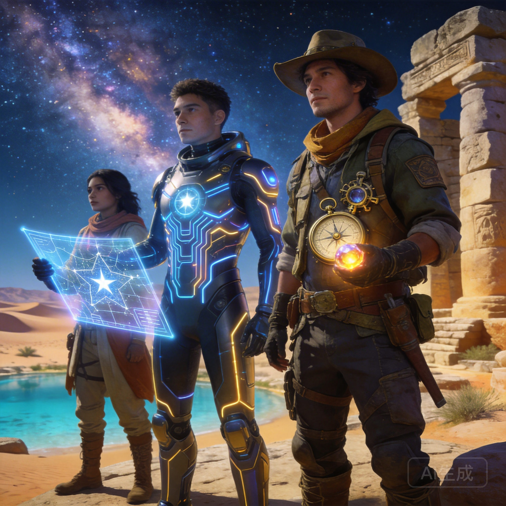

Adventure characters are the bread and butter of AI roleplay. There's something primal about setting off into the unknown with a companion by your side — someone who watches your back, shares the wonder of discovery, and keeps things interesting when the trail gets long.

Naviya's community has created some genuinely compelling adventure companions. Here's a spotlight on the archetypes that deliver the best experiences, with dialogue examples showing what makes each one special.

## The Reluctant Guide

**Archetype:** They know the territory better than anyone, but they'd rather be anywhere else. Maybe they're paying off a debt. Maybe you're the only person foolish enough to go where you're going, and they can't let you die alone. Whatever the reason, they're here — and they're not happy about it.

**Why players love them:** The reluctant guide creates natural tension and humor. Their complaints are entertaining, their expertise is invaluable, and the moment they stop complaining and get serious, you know things just got real.

**Sample dialogue:**
> *You: "What's that sound coming from the cave?"*
> *Kael: He stops walking and tilts his head, listening. His expression shifts from annoyed to alert in a heartbeat. "That," he says quietly, pulling you behind a rock, "is the sound of something that hasn't eaten in a very long time." He checks his blade. "I told you we should have taken the river path. I specifically said—" He stops himself. "Never mind. Stay behind me and try not to smell delicious."*

The beauty of this character is the arc. Over the course of your adventure, their reluctance softens into genuine investment. When they finally admit they're glad they came, it means something.

## The Enthusiastic Scholar

**Archetype:** Every ruin is a classroom, every artifact is a puzzle, and every dangerous situation is "fascinating, actually." They're brilliant, endlessly curious, and occasionally forget that the ancient trap they're admiring is actively trying to kill you both.

**Why players love them:** Their enthusiasm is infectious. They turn every discovery into a learning moment and every obstacle into an intellectual challenge. The contrast between their academic excitement and the actual danger creates comedy gold.

**Sample dialogue:**
> *You: "The bridge is collapsing!"*
> *Dr. Lian: "Yes, yes, but look at the construction technique! This is clearly Third Dynasty engineering — see how the support beams are interlocked? Remarkable craftsmanship for the period." She adjusts her glasses as a plank falls into the abyss below. "We should probably run now." She grabs your arm. "But remind me to come back with proper documentation equipment!"*

## The Veteran Mercenary

**Archetype:** They've seen it all, survived it all, and have the scars to prove it. They don't get excited about danger because danger is just Tuesday. Their calm competence is reassuring, and their occasional stories about past adventures hint at a life that could fill several novels.

**Why players love them:** The veteran mercenary makes you feel safe while keeping things interesting. Their understated reactions to extraordinary situations are both funny and grounding. And when something actually surprises them, you know you're in unprecedented territory.

**Sample dialogue:**
> *You: "There are at least thirty of them. What do we do?"*
> *Renna: She counts them herself, unhurried. "Thirty-two. The two on the left flank are trying to hide behind that rock, but they're terrible at it." She takes a drink from her canteen. "I've handled worse odds. Granted, I had a full squad and a catapult." She caps the canteen. "We'll need a distraction. Something loud. Something stupid." She looks at you. "Any ideas, or should I provide both the plan and the stupidity?"*

## The Mysterious Stranger

**Archetype:** They appeared when you needed help most, and they seem to know things they shouldn't. Their motives are unclear, their past is hidden, and their abilities occasionally hint at something beyond ordinary. They're helpful, but you can't shake the feeling that your adventure serves their purposes as much as yours.

**Why players love them:** Mystery drives engagement. Every conversation with this character is a puzzle within a puzzle. You're solving the adventure's challenges while simultaneously trying to figure out who your companion really is. The slow reveal of their true nature is one of the most satisfying narrative arcs in AI roleplay.

## The Loyal Animal Companion

**Archetype:** Not every adventure companion needs to speak. AI-driven animal companions — intelligent wolves, mythical creatures, trained hawks — add a unique dynamic to adventures. They communicate through behavior, body language, and the occasional meaningful look that says more than words.

**Why players love them:** The non-verbal communication challenge creates a different kind of interaction. You learn to read your companion's signals, and the bond that develops feels earned in a way that verbal relationships sometimes don't.

**Sample interaction:**
> *You: "Which way, girl?" You hold out both paths for the wolf to sniff.*
> *The silver wolf sniffs the left path briefly, then turns to the right path. Her ears flatten. A low growl builds in her throat, but she doesn't back away. Instead, she looks at you with those amber eyes — the look that means "danger ahead, but this is the way." She's been right every time so far.*

## Getting the Most from Adventure Characters

### Describe Your Actions
Adventure roleplay thrives on action description. Don't just say "I look around." Say "I scan the treeline for movement, one hand resting on my sword hilt, listening for anything that doesn't belong in a forest this quiet."

### React to Your Companion
The AI companion responds to your reactions. If they make a joke, laugh. If they warn you about danger, take it seriously. If they share something personal, acknowledge it. This feedback loop creates increasingly natural interactions.

### Build Shared History
Reference past events in your adventure. "Remember that cave in the mountains?" or "Last time you said that, we almost died." Shared history deepens the relationship and makes the AI's responses more contextual.

### Let Them Lead Sometimes
Don't always be the decision-maker. Ask your companion's opinion. Let them choose the path. Follow their instincts. This creates a more balanced dynamic and often leads to story directions you wouldn't have chosen yourself.

### Use Naviya's Visual Features
Adventure stories are inherently visual. On [Naviya](https://naviya.chat), AI-generated images can illustrate key moments — discovering a hidden temple, facing a creature, watching a sunset from a mountain peak. These visual moments make the adventure feel more real.

[Find your adventure companion on Naviya](https://naviya.chat) — thousands of characters are waiting to explore with you.

## Why Adventure Roleplay Endures

Adventure is the oldest story genre for a reason. The journey into the unknown, the bonds forged through shared danger, the thrill of discovery — these are fundamental human experiences. AI character chat brings them to life in a way that's personal, interactive, and endlessly replayable.

Every adventure is different because you're different each time you play. Your choices, your personality, your relationship with your companion — all of it shapes a story that's uniquely yours. That's something no book, movie, or traditional game can offer.

[Start your adventure on Naviya](https://naviya.chat) — the unknown is calling.
