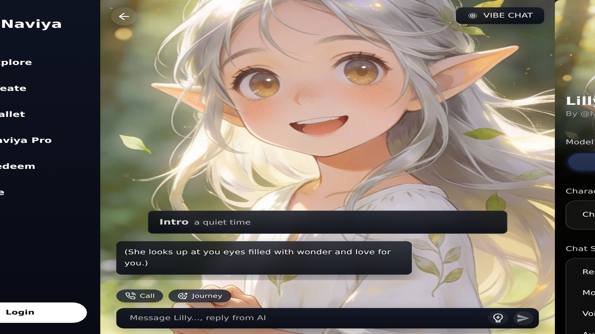

# AI Conversation Practice Apps Worth Downloading in 2026

If improving your speaking confidence tops the 2026 to-do list, you need an AI conversation practice app that sounds natural, adapts to your goals, and stays available when your classmates or coworkers are asleep. I trialed the leading tools for travel prep, interview drills, and storytelling, then measured how they personalize prompts, track progress, and pair text chat with voice or visuals. Every app on this list hits the baseline of realistic replies, but their coaching styles differ dramatically.

## What to Expect From Modern AI Conversation Practice Apps

The best apps deliver:

- **Adaptive prompts** that escalate difficulty as you improve.
- **Real-time feedback** on pacing, filler words, and vocabulary variety.
- **Scenario libraries** for interviews, travel, customer support, and creative storytelling.
- **Safe environments** with clear data policies and reporting tools.

A 2025 [British Council study](https://www.britishcouncil.org/school-resources/find/studies-on-conversation-practice) showed language learners who practiced with AI chat partners four times per week improved speaking scores by 18% compared to textbook-only peers. Consistency is everything, so prioritize apps that make it easy to log in daily.

## Naviya: Story-Driven Conversation Partner

Naviya is known for roleplay, but its conversation practice templates deserve more hype. You can load customizable mentors — think "empathetic recruiter", "curious traveler", or "patient improv coach" — and adjust difficulty via personality sliders. Naviya's characters remember facts across sessions, so you can practice long-form storytelling or interview narratives without repeating yourself.

- **Setup**: Pick an archetype from the [Naviya character library](https://naviya.chat/characters) or build your own mentor in the [create tool](https://naviya.chat/create).
- **Feedback**: After each session, the analytics card (highlighted on the [features page](https://naviya.chat/features)) surfaces filler words, tonal shifts, and suggestions for next time.
- **Access**: Sessions sync across web, iOS, and Android. Install via the [download hub](https://naviya.chat/download) and keep practicing during commutes.

**Need structured drills? [Launch the conversation coach workflow in Naviya](https://naviya.chat/create)** and save presets for interviews, language exchanges, or presentation rehearsals.

## LingoLoop Horizon

LingoLoop specializes in pronunciation coaching. The app transcribes your speech while an AI tutor responds verbally. Horizon's biggest improvement this year is "Accent Feedback," a panel that highlights mispronounced sounds and links to bite-sized video lessons. For bilingual learners, LingoLoop supports code switching, so you can practice bilingual customer support calls.

Horizon lacks the narrative flexibility of Naviya, but it's unbeatable for phonetics-focused training.

## Speakwise Stagecraft

Speakwise leans into performance coaching: mock press conferences, pitch meetings, and storytelling nights. The AI anchor poses questions, cross-examines your points, and prompts you to back claims with data. Stagecraft's "Audience Mode" simulates panel reactions, adding pressure without the nerves of a real auditorium.

Downside: Stagecraft currently runs only on desktop, so mobile practice is limited to passive review of transcripts.

## FluentFrame Travel Coach

FluentFrame targets travelers who want to negotiate markets or ask for help abroad. The app breaks conversations into scenes (airport check-in, café banter, emergency situations) and mixes voice plus AR cues. Point your phone camera at a sign, and FluentFrame generates a dialogue about it. It also stores offline phrase packs for low-connectivity trips.

However, FluentFrame's AI occasionally over-explains grammar mid-scenario, which can interrupt immersion. Toggle "Immersive Mode" to keep responses concise.

## MentorLoop Interviews

If you're prepping for job interviews, MentorLoop is worth the download. It scans job descriptions, creates custom behavioral questions, and nudges you to include metrics. After each answer, MentorLoop suggests follow-up questions to help you drill deeper. There's even a "panic button" that generates a compassionate pep talk when nerves spike.

MentorLoop doesn't currently handle non-work scenarios, so you'll still want a more generalist partner like Naviya for storytelling practice.

## Matching Apps to Goals

| Goal | Recommended App |
| --- | --- |
| Narrative storytelling & creativity | Naviya |
| Pronunciation & phonetics | LingoLoop Horizon |
| Executive presence | Speakwise Stagecraft |
| Travel survival | FluentFrame |
| Interview prep | MentorLoop |

This table isn't exhaustive, but it helps you avoid decision fatigue. Most learners pair two apps: Naviya for expressive practice plus a specialist for accent or interview polish.

## Daily Routine for Faster Progress

1. **Warm-up (5 minutes)**: Open Naviya on mobile, chat with a casual character, and focus on pacing.
2. **Deep work (15 minutes)**: Load your specialist app (LingoLoop or Speakwise) for targeted drills.
3. **Reflection (5 minutes)**: Use Naviya's session notes or export logs to a journal. Write down one phrase you loved and one to fix.
4. **Weekly review**: Visit the [features analytics page](https://naviya.chat/features) to track conversation length, sentiment, and vocabulary diversity.

## Keeping Motivation High

- **Gamify**: Set streak targets. Naviya displays badges for consecutive days, which helps habit-building.
- **Social accountability**: Share transcripts with a tutor or friend by publishing temporary links via the [characters gallery](https://naviya.chat/characters).
- **Micro-prompts**: Save 60-second scenarios in the [create flow](https://naviya.chat/create) so you can squeeze practice between meetings.

## Accessibility and Safety Considerations

Look for apps that support screen readers, adjustable text sizes, and captioned voice replies. Naviya's interface now mirrors system fonts for easier reading. Data-wise, prioritize platforms that let you delete transcripts or export them securely. Harvard's 2025 [Center for Digital Literacy report](https://cyber.harvard.edu/story/2025-02/ai-language-practice-privacy) reminds learners to vet privacy policies because voice recordings can include sensitive details.

## Pricing Snapshot

- **Naviya**: Free tier with unlimited chats; premium unlocks extra characters and faster image rendering.
- **LingoLoop Horizon**: $12/month for pronunciation analytics.
- **Speakwise Stagecraft**: $19/month for performance scenarios.
- **FluentFrame**: $10/month or $60/year.
- **MentorLoop**: $25/month, mainly targeting job seekers.

Prices fluctuate, so always confirm before subscribing. Use free trials to see if the coaching style resonates.

## Case Study: Career Switcher Boost

Marisol, a UX designer pivoting into product strategy, spent six weeks pairing Naviya with MentorLoop. Here's the cadence that took her from shaky interviews to confident storytelling:

1. **Morning reflection**: She opened Naviya's "Supportive Recruiter" character, summarized a recent project, and asked for follow-up questions.
2. **Afternoon drill**: MentorLoop generated behavioral prompts based on the latest job posting. Marisol recorded answers aloud, received feedback on metrics mentions, and copied the best phrasing into Naviya's memory slots so future chats referenced the same success stories.
3. **Weekly review**: Every Sunday she exported transcripts, highlighted recurring filler words, and set goals ("replace 'kind of' with concrete verbs").
4. **Final tune-up**: The night before interviews, she reheated her favorite Naviya mentor in mobile view to simulate on-the-go questions.

Outcome: She reported a 40% increase in recruiter callbacks and felt calmer because the AI remembered her anecdotes, making each session feel like a friendly catch-up rather than an interrogation.

## FAQ: AI Conversation Practice in 2026

**Do these apps replace human tutors?** Not entirely. Think of them as sparring partners between tutoring sessions. Human coaches still excel at nuanced feedback, but AI partners keep you practicing daily without scheduling headaches.

**How do I avoid over-reliance on scripts?** Rotate scenarios and intentionally improvise. In Naviya, toggle "Adaptive Mode" so the mentor asks unexpected follow-ups. With LingoLoop, randomize accent targets to stay flexible.

**Can I use these apps for therapy or mental health coaching?** No. They can support self-expression, but they are not licensed therapists. If conversations trigger anxiety, pause and contact a professional.

**What about data privacy?** Read transparency reports; Naviya outlines retention windows on the [features page](https://naviya.chat/features), while MentorLoop shares compliance summaries in its help center. Export sessions you want to keep, then delete the originals if you're concerned.

## How to Track Progress Without Burning Out

1. **Weekly sentiment review**: Naviya's dashboards grade each session on energy and tone. Screenshot the chart, jot two wins, and set one focus for next week.
2. **Monthly benchmark call**: Record yourself answering the same three questions, then compare to last month's clip. If you're not improving, change the scenario mix.
3. **Peer accountability**: Invite a friend to your Naviya roster via the [characters gallery](https://naviya.chat/characters) and schedule a five-minute debrief every Friday.
4. **Reward milestones**: When you hit 20 sessions, regenerate your mentor's portrait inside the [create flow](https://naviya.chat/create) to mark progress. Visual cues make streaks tangible.

## Final Checklist Before Downloading

1. Does the app offer offline or low-bandwidth modes for travel days?
2. Can you share sessions with a tutor for accountability?
3. Are analytics actionable, or do they just spit out vanity scores?
4. Do you enjoy the characters' voices? If not, you'll quit early.

## Closing Thoughts

Any AI conversation practice app can feed you prompts, but Naviya stands out for long-form storytelling, empathetic mentors, and flexible creation tools. Pair it with a specialist that targets your weak spots and you'll progress faster than juggling random chatbots.

**Ready to start practicing? [Download Naviya and meet your conversation coach](https://naviya.chat/download)** — spend the first five minutes customizing a mentor, then bookmark the workflow for daily reps.
