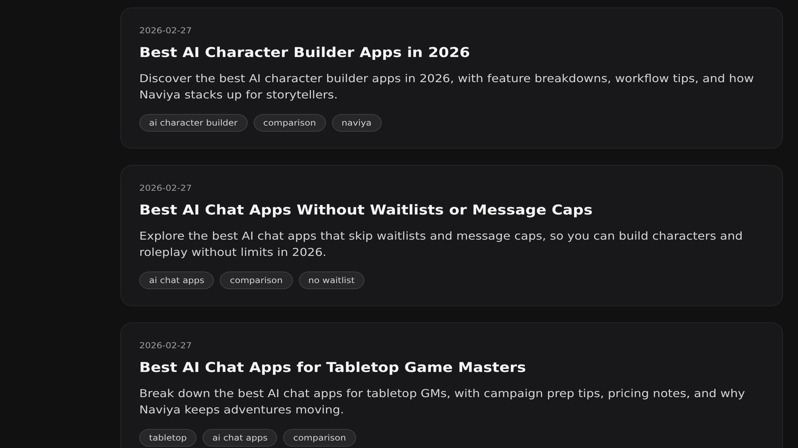

# Best AI Dungeon Alternatives for Storytellers in 2026

AI Dungeon helped a generation of interactive fiction writers realize that AI could keep up with their imagination, but in 2026 the best AI Dungeon alternative depends on what kind of storyteller you are. Maybe you want richer character memories, maybe you crave visual cues, or maybe you just need an AI that can keep your continuity straight. This guide dives into the strongest options so you can pick the AI roleplay chat platform that actually supports the worlds you build.

## Why Look Beyond AI Dungeon Right Now

The AI Dungeon alternative conversation often starts with model quality, but the real friction writers report is context collapse. Latitude has made strides, yet their official Discord is still filled with users logging bugs about forgotten side plots after five or six turns. A recent [Reddit AMA with the Latitude team](https://www.reddit.com/r/AIDungeon/comments/18j1aif/we_are_the_ai_dungeon_team_ask_us_anything/) acknowledged that world info limits make it difficult to juggle multiple arcs at once. If your campaign spans kingdoms, that's a dealbreaker.

Naviya, NovelAI, TextCortex Loreweaver, and a growing wave of boutique tools give you knobs AI Dungeon never prioritized: per-character motivation sliders, turn-by-turn memory pins, and even AI-generated concept art that sets the tone for every new scene. When you're trying to keep five main characters consistent across a 40-session arc, those knobs matter more than raw token length.

## Naviya: Character-First Roleplay With Visual Support

Naviya's pitch is simple—build an AI character, drop them into a channel, and let them react like a cast member rather than a narrator. For storytellers, the killer feature is the ability to lock in relationship dynamics and goals for each persona. You can anchor a "rebellious archmage" to always prioritize protecting an apprentice, or have a rival pilot escalate any stalemate. Because Naviya stores per-character lore blocks, you can reintroduce them into a new campaign without rewriting their backstory.

Another advantage is visual scaffolding. Naviya can generate inline hero images or mood sketches for each major beat. That sounds cosmetic until you're explaining a new locale to your tabletop group over voice chat—suddenly the aesthetic pins help everyone stay aligned. **Curious how it feels in practice? [Spin up a fresh crew on Naviya and test a scene for free](https://naviya.chat/create).**

Internal links also keep worldbuilding tidy: you can share a finished character profile via `[Naviya Characters](https://naviya.chat/characters)` so collaborators can inspect traits, and the mobile apps sync those traits automatically. When you're juggling recordings, notes, and art boards, that kind of source of truth is priceless.

## NovelAI: Literary-Focused Output With Custom Modules

NovelAI remains the go-to for prose purists. Their Sigurd and Kayra models produce flowing paragraphs with minimal coaxing, and the "Modules" feature lets you define genre-specific rules. Want sentences dripping with gothic adjectives? Install the Dark Academia module. Need the dialogue to mimic radio drama banter? There's a module for that. NovelAI lacks Naviya's multi-character interplay, but it excels at long-form narration.

NovelAI's roadmap also includes collaborative features. In January, the team shared a [public update on their GitHub wiki](https://github.com/NovelAI/wiki/wiki/Roadmap) that teased shared story canvases where multiple writers can edit the same session. If you primarily write solo but occasionally workshop with friends, NovelAI is a strong AI Dungeon alternative.

## TextCortex Loreweaver: Notes Meet Narrative

TextCortex pivoted Loreweaver into a lightweight campaign manager. Every time you add a paragraph of lore, Loreweaver tags it, indexes it, and surfaces it when you type relevant prompts. Think Notion or Obsidian, but with an AI narrator ready to riff on your notes. It's brilliant for writers who love keeping wikis yet hate rewriting the same exposition.

Where Loreweaver falls short is real-time dialogue. It's slower than Naviya, and it doesn't have a mobile experience that feels joyful. Still, if your AI Dungeon alternative criteria revolve around research and continuity, Loreweaver deserves a slot in your stack.

## LoreForge & Community-Built Tools

Indie experiments such as LoreForge and KoboldAI forks continue to thrive on GitHub. They cater to power users who want to fine-tune models locally or pipe in their own embeddings. The tradeoff is maintenance overhead; you become your own support desk. For teams that crave maximum control or need to keep proprietary settings offline, that tradeoff is worth it. Everyone else may prefer the polish of hosted platforms like Naviya.

> Want a hosted option that still lets you tweak temperature, persona ground rules, and image prompts? **[Try Naviya's advanced chat workspace](https://naviya.chat/features/advanced-roleplay) and see how quickly you can enforce canon.**

## How to Choose the Right Alternative

Create a requirements checklist before you migrate. Do you need multiplayer channels? Voice replies? Visual aids? Long memory? If you already run a tabletop session, ask your players which features would actually improve their experience. Then map those must-haves against each contender. A simple spreadsheet with columns for "Context window", "Memory pins", "Visuals", "Price", and "Mobile" can reveal the best match faster than endless trial-and-error.

I also recommend stress-testing with the same scenario. Run a political negotiation scene across three platforms and watch how each AI handles callbacks, tone, and POV shifts. Keep transcripts in a folder so you can compare side-by-side. You'll notice quickly which platform flattens characters into generic voices and which one keeps their quirks intact.

## Sample Workflow for Campaign Builders

1. Start in Naviya's builder and define your key characters.
2. Export the summary via `[Naviya character sheet](https://naviya.chat/characters/inspector)` so collaborators can review.
3. Draft a pilot scene inside Naviya to capture the emotional core.
4. Copy transcripts into Loreweaver to tag names, locations, and artifacts.
5. Use NovelAI or your writing app of choice to turn memorable beats into prose chapters.

This multi-app workflow gives you the spontaneity of chat plus the polish of narrative editing. You can scale down if you're solo, but teams often appreciate having a specialized tool for each phase.

## Final Checklist Before You Switch

- Back up your favorite AI Dungeon adventures.
- List the features your group actually uses.
- Run a sample scene on two alternatives.
- Gather feedback from friends or readers.
- Decide whether to migrate entirely or run parallel tests for a month.

## Wrap-Up

The AI Dungeon alternative conversation isn't about abandoning a classic—it's about upgrading your toolbox. Naviya shines for character-driven, image-supported roleplay. NovelAI remains unbeatable for literary narration. Loreweaver thrives on lore organization. Indie tools give you ultimate control. Pick the mix that matches your creative process, and don't be afraid to rotate apps as your story evolves. **Ready to start a new chapter? [Download Naviya on iOS or Android](https://naviya.chat/download) and invite your party tonight.**

## Case Study: Porting a Long-Running Campaign

My own guild has 48 sessions' worth of AI Dungeon transcripts. We migrated to Naviya over a weekend by prioritizing emotional beats instead of copying everything verbatim. We fed the final recap paragraph of each session into Naviya's knowledge drawer, then asked the AI to summarize each character's current motivation. The result: a tight two-page campaign brief that every player can reference before logging in. Conflict arcs that used to get lost in the shuffle—like the engineer's loyalty crisis—now get referenced automatically by the AI because the motivation slider is locked.

We also layered in visuals. Every time the party landed on a new planet, we generated a hero image inside Naviya and dropped it into our shared Notion. Players told us those images made it easier to remember which NPC ran which tavern. It's such a small touch, but it adds just enough sensory detail that callbacks land harder.

## Frequently Asked Questions

**Does switching hurt my existing AI Dungeon subscription?** Not at all. Many creators keep AI Dungeon for solo experimentation while using Naviya or Loreweaver for collaborative sessions. Treat them as complementary rather than mutually exclusive.

**What about safety filters?** Each platform approaches moderation differently. Naviya focuses on SFW but allows nuanced romance arcs as long as they stay respectful. Loreweaver leaves moderation largely up to the workspace owner. Read each policy carefully before inviting a public community.

**Can I import lore files?** Naviya supports importing text snippets into memory slots, while Loreweaver accepts Markdown or .docx. AI Dungeon also supports world info CSV imports, but the field count is limited. Plan your taxonomy before migrating so you stay organized.

By planning the migration and giving each platform a clear role, you avoid the chaos of juggling half-built characters. Give yourself two weekends to experiment, gather transcripts, and pick the combo that helps you tell better stories.
