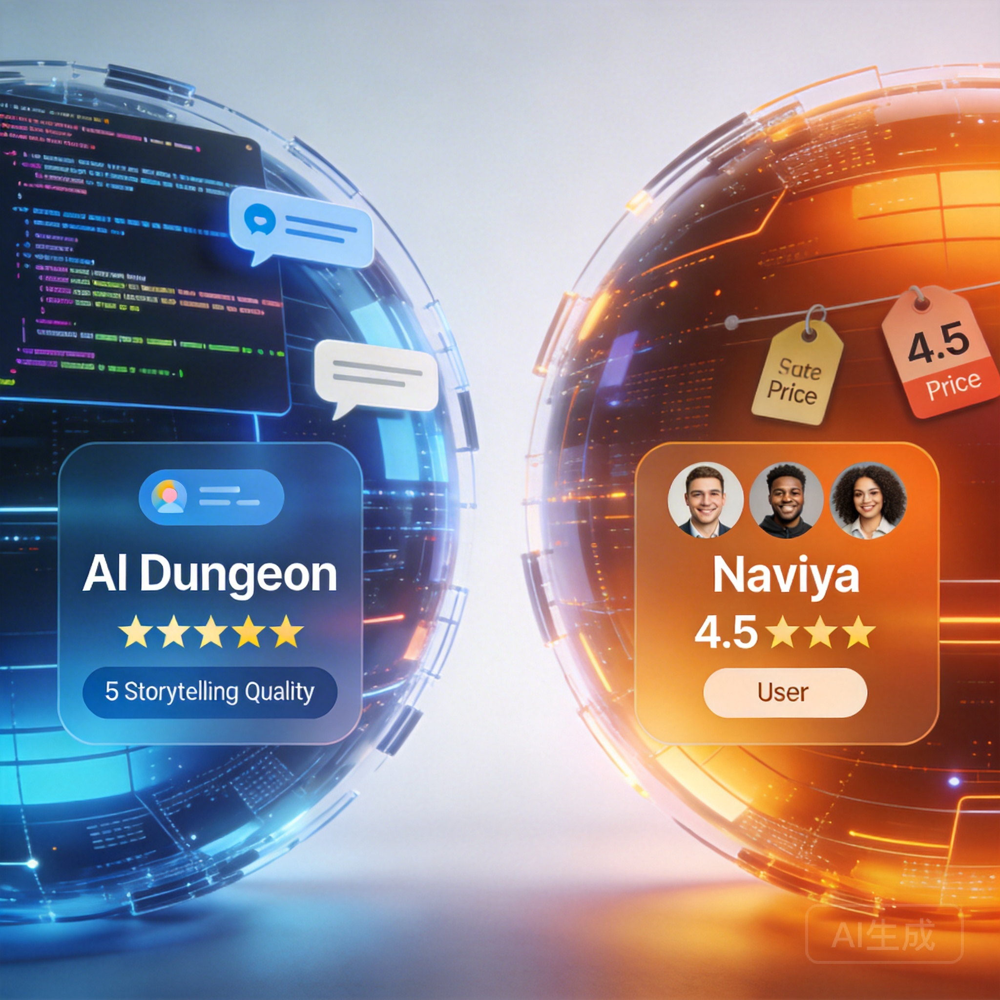

AI Dungeon and Naviya represent two different philosophies in AI-powered interactive entertainment. AI Dungeon pioneered the open-world text adventure format — type anything, go anywhere, do anything. Naviya takes a character-first approach where deep, persistent AI personalities drive the experience. Both are excellent, but they serve different needs.

This comparison breaks down exactly where each platform excels and where it falls short, so you can pick the one that fits how you actually want to use AI chat.

## The Core Difference

**AI Dungeon** is a storytelling engine. You're the protagonist in a narrative, and the AI is your game master. The focus is on plot, action, and world exploration. Think of it as a text-based RPG with infinite possibilities.

**Naviya** is a character interaction platform. You're having conversations with AI personalities that have defined traits, backstories, and emotional depth. The focus is on relationships, dialogue, and character development. Think of it as meeting interesting people who happen to be AI.

Neither approach is objectively better — it depends on what you're looking for.

## Storytelling Quality

### AI Dungeon
AI Dungeon's narrative engine handles open-ended scenarios remarkably well. You can start a fantasy quest, pivot to a space opera, and end up in a detective noir — all in the same session. The AI adapts to genre shifts and maintains reasonable narrative logic.

However, longer stories can lose coherence. The AI sometimes forgets earlier plot points or introduces contradictions. The premium models (Dragon, Griffin) handle this better than the free tier, but it's still a limitation of the format.

### Naviya
Naviya's storytelling happens through character interactions rather than narrated adventures. The AI characters maintain consistent personalities across conversations, remember your shared history, and develop over time. This creates a different kind of narrative — one driven by relationships rather than plot.

The addition of AI-generated comic panels and images adds a visual storytelling layer that AI Dungeon doesn't offer. Key moments in your conversation become illustrated scenes, creating a graphic novel quality to the experience.

**Winner:** AI Dungeon for plot-driven adventures. Naviya for character-driven stories.

## Character Depth

### AI Dungeon
Characters in AI Dungeon are functional — they serve the story. NPCs appear when needed, deliver their lines, and move the plot forward. You can create character cards with backstories, but the AI treats them as story elements rather than persistent personalities.

### Naviya
This is where Naviya pulls ahead significantly. Characters on Naviya have detailed personality profiles, speaking styles, emotional patterns, and backstories that the AI consistently maintains. A sarcastic detective character stays sarcastic. A shy librarian character stays shy. The consistency creates genuine attachment.

With 10,000+ community-created characters, you'll find everything from historical figures to original creations. Each character feels like a distinct individual rather than a generic AI wearing a costume.

**Winner:** Naviya, decisively. Character depth is its core strength.

## Features Comparison

### Voice Chat
- **AI Dungeon:** No native voice chat
- **Naviya:** Full voice chat with AI characters maintaining personality in spoken conversation

### Image Generation
- **AI Dungeon:** Basic image generation available
- **Naviya:** AI-generated images and comic panels integrated into conversations

### Character Creation
- **AI Dungeon:** Scenario and character card creation with moderate depth
- **Naviya:** Detailed character creation with personality traits, speech patterns, and behavioral settings

### Mobile Experience
- **AI Dungeon:** Solid mobile app, text-focused
- **Naviya:** Polished mobile app with full feature parity

### Community
- **AI Dungeon:** Established community with shared scenarios and adventures
- **Naviya:** Growing community with 10,000+ shared characters

### Multiplayer
- **AI Dungeon:** Supports multiplayer adventures
- **Naviya:** Currently single-player focused

## Pricing

### AI Dungeon
- Free tier with basic model
- Hero plan: ~$10/month (better model, more actions)
- Legend plan: ~$30/month (best model, unlimited)

### Naviya
- Free tier with generous allowance
- Premium subscription for unlimited chatting and features

Both platforms offer enough in their free tiers to evaluate the experience before paying. AI Dungeon's premium tiers are more granular, while Naviya keeps it simpler with a single premium tier.

**Winner:** Tie — both offer fair value at their price points.

## Who Should Choose What

**Choose AI Dungeon if you:**
- Love open-world text adventures
- Want to be the protagonist in epic stories
- Enjoy plot-driven narratives with action and exploration
- Want multiplayer storytelling with friends
- Prefer pure text experiences

**Choose Naviya if you:**
- Want deep, meaningful character interactions
- Enjoy character-driven stories and relationship development
- Want voice chat and visual elements in your experience
- Like creating or chatting with unique AI personalities
- Prefer a multimedia experience over pure text

## Can You Use Both?

Absolutely, and many people do. AI Dungeon for when you want an adventure, [Naviya](https://naviya.chat) for when you want a conversation. They scratch different itches, and there's no reason to limit yourself to one platform.

The AI chat space is big enough for different approaches to coexist. The real winner is you — having options means you can match the tool to your mood.

[Try Naviya free](https://naviya.chat) and see how character-focused AI chat compares to what you're used to.

## Final Thoughts

AI Dungeon deserves credit for creating the AI interactive fiction category. It remains the best platform for open-ended text adventures. But the landscape has evolved, and platforms like Naviya show that AI chat can be about more than just storytelling — it can be about connection, creativity, and experiences that blend text, voice, and visuals.

The best choice depends entirely on what you want from AI interaction. Try both, and let the experience speak for itself.
