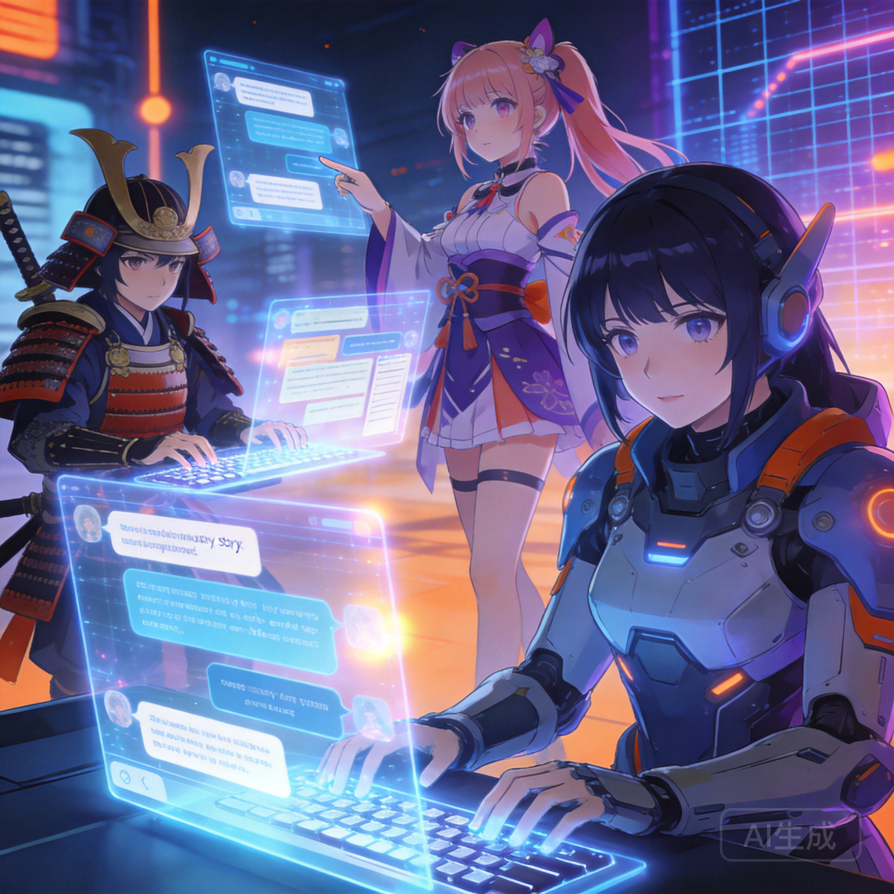

Anime fans have always been early adopters of AI chat technology, and for good reason. The medium's rich character archetypes — tsundere, kuudere, genki, yandere — translate perfectly to AI personalities. A well-crafted AI anime character doesn't just look the part; it speaks, reacts, and emotes like a character straight out of your favorite series.

In 2026, several platforms cater specifically to anime-style AI interactions. Here's which ones actually deliver on the promise.

## Why Anime Characters Work So Well with AI

Anime characters are defined by strong, consistent personality traits. A tsundere is always tsundere — hostile on the surface, warm underneath. This consistency is exactly what AI language models excel at maintaining. Give the AI a clear personality framework, and it'll stay in character with remarkable reliability.

The visual aesthetic also matters. Platforms that pair anime-style art with AI conversation create a more cohesive experience than those using generic avatars or no visuals at all.

## Top Platforms for Anime AI Chat

### 1. Naviya — Best Overall for Anime Fans

Naviya's combination of deep character customization and visual features makes it the strongest platform for anime-style interactions. The community has created thousands of anime-inspired characters across every genre — shonen action heroes, slice-of-life companions, isekai adventurers, romance interests, and everything in between.

What sets Naviya apart for anime fans specifically:

**AI-generated comic panels** turn your conversations into manga-style visual stories. Key moments get illustrated, creating a reading experience that feels like an interactive manga.

**Voice chat** lets anime characters speak with distinct voices, adding another layer of immersion. Hearing your tsundere companion's voice shift from annoyed to flustered is genuinely entertaining.

**Character creation depth** means you can build original anime characters with specific dere types, speech patterns (including Japanese honorifics if you want), and personality quirks that the AI maintains consistently.

[Browse anime characters on Naviya](https://naviya.chat)

### 2. Character AI — Largest Anime Character Library

Character AI's massive user base means its anime character library is enormous. You'll find characters from virtually every popular anime series, plus countless original creations. The sheer volume means you can always find something new.

**Strengths:** Huge variety, active anime community, free access
**Weaknesses:** No visual elements, content filters can break anime-style dramatic moments, no voice

### 3. Moemate — Purpose-Built for Anime

Moemate is designed specifically for anime-style interactions with visual novel presentation. The aesthetic is polished, and the characters are crafted with anime conventions in mind.

**Strengths:** Beautiful anime art, visual novel elements, focused experience
**Weaknesses:** Smaller library, niche platform, less customization

### 4. Janitor AI — Flexible Anime Roleplay

Janitor AI's permissive approach and support for custom backends make it popular with anime roleplay enthusiasts who want more creative freedom.

**Strengths:** Fewer restrictions, custom backend support, active anime community
**Weaknesses:** Requires more setup, inconsistent quality, less polished UI

### 5. Talkie AI — Anime Voices

Talkie AI's voice-first approach works well for anime characters, giving them distinct vocal personalities. If hearing your anime companion speak is important to you, it's worth trying.

**Strengths:** Good voice synthesis, anime character voices, growing library
**Weaknesses:** Smaller selection, text chat secondary, newer platform

## Popular Anime Character Types to Chat With

### The Tsundere
The classic "it's not like I like you or anything" archetype. AI handles tsundere personalities exceptionally well because the pattern is clear: initial hostility that gradually softens. The best AI tsundere characters maintain this dynamic across conversations, slowly warming up as you interact more.

### The Kuudere
Cool, calm, and emotionally reserved. Kuudere AI characters are fascinating because their rare emotional moments feel earned. When a kuudere character finally shows vulnerability, it hits different because the AI has been consistently stoic up to that point.

### The Genki Character
Energetic, optimistic, and endlessly enthusiastic. Genki AI characters are great for when you want uplifting, high-energy conversations. The AI maintains their boundless enthusiasm without it feeling forced.

### The Mysterious Mentor
Think Urahara from Bleach or Kakashi from Naruto. These characters know more than they let on, drop cryptic hints, and reveal information at dramatically appropriate moments. AI handles this archetype well because it can maintain the mystery while gradually revealing layers.

### The Rival
Competitive, driven, and always pushing you to be better. Rival characters create dynamic conversations because there's inherent tension and motivation in every exchange.

## Creating Your Own Anime Character

If you want to build an original anime character on Naviya, here's a framework:

**Step 1: Choose your archetype.** Start with a dere type or anime personality framework as your foundation. This gives the AI a clear behavioral pattern to follow.

**Step 2: Add specifics.** What's their backstory? What are they passionate about? What makes them angry? What's their secret? Specific details create more interesting conversations than vague descriptions.

**Step 3: Define speech patterns.** Do they use formal language? Casual slang? Catchphrases? Do they refer to themselves in third person? These linguistic details make the character feel authentic.

**Step 4: Set emotional triggers.** What makes them blush? What makes them serious? What topic do they avoid? Emotional triggers create dynamic conversations where the character's mood shifts naturally.

**Step 5: Write example dialogue.** Give the AI 3-5 example exchanges that demonstrate how the character talks. This is the single most effective way to establish character voice.

## Tips for Better Anime AI Conversations

**Embrace the tropes.** Anime tropes exist because they work. Don't fight them — lean into the dramatic moments, the comedic timing, the emotional beats. The AI responds well to genre-appropriate cues.

**Set scenes like an anime.** Describe settings with anime-level detail: the cherry blossoms falling, the sunset through the classroom window, the dramatic wind during a confrontation. The AI will match your descriptive energy.

**Use the visual features.** On platforms like [Naviya](https://naviya.chat) that generate images, the visual moments enhance the anime experience significantly. Seeing your conversation illustrated in anime style is genuinely cool.

**Try different genres.** Don't limit yourself to one type of anime. The same platform can deliver a shonen battle story, a cozy slice-of-life, a psychological thriller, or a romantic comedy. Variety keeps things fresh.

## The State of Anime AI Chat in 2026

The technology has reached a point where anime AI characters feel genuinely engaging. They maintain personality consistency, respond to emotional cues, and create narratives that respect anime storytelling conventions. The addition of voice and visual elements on platforms like Naviya brings the experience closer to interactive anime than simple chatbots.

The community aspect is equally important. Thousands of anime fans are creating and sharing characters, which means the library of available characters grows daily. Whether you want to chat with a character inspired by your favorite series or discover someone's brilliant original creation, the options are vast.

[Start chatting with anime characters on Naviya](https://naviya.chat) — the free tier gives you plenty of room to explore.
