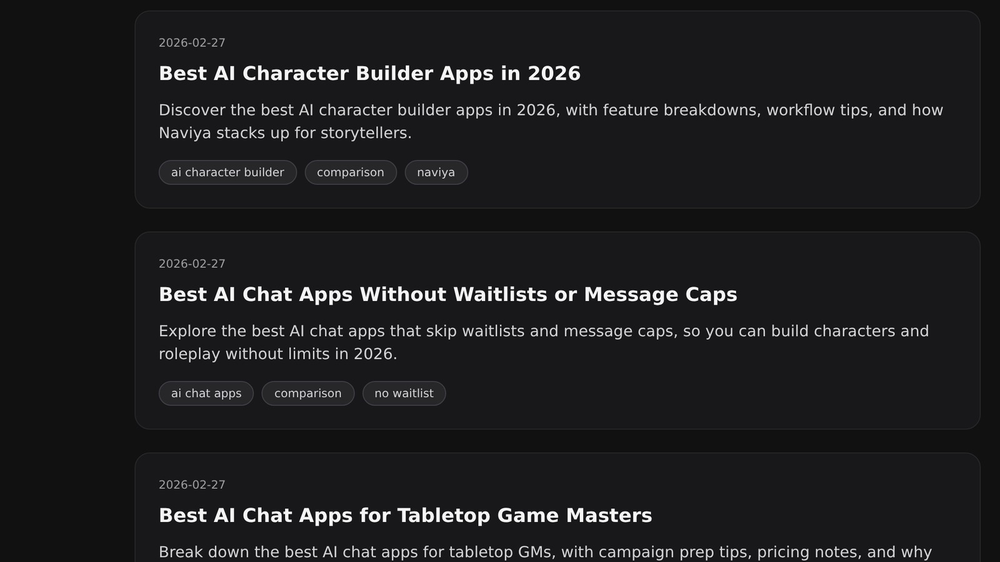

# Best AI Character Builder Apps in 2026

The AI character builder landscape exploded this year, and creators now juggle half a dozen dashboards to craft believable personalities. If you are hunting for the most capable AI character builder in 2026, this guide breaks down how each tool handles lore, safety, art, and performance so you can stop tab-hopping and start storytelling. I tested prompt editors, image pipelines, and multi-turn memory systems across the leading apps to highlight which workflows suit writers, GMs, educators, and studio teams.

## How I Evaluated Each AI Character Builder

Great builders combine narrative control, safety guardrails, collaboration, and export options. My scorecard weighed:

- **Concept depth**: multi-sheet bios, voice references, relationship graphs.
- **Simulation quality**: grounding memory, emotion sliders, adjustable randomness.
- **Asset support**: built-in image generation, audio cues, or API hooks.
- **Availability**: no waitlists, clear terms, and transparent premium upgrades.
- **Team collaboration**: profile sharing, permissions, analytics.

External research like the [McKinsey Generative AI report](https://www.mckinsey.com/capabilities/mckinsey-digital/our-insights/the-economic-potential-of-generative-ai) highlights how integrated tooling accelerates production, so I weighted suites that let you ideate, test, and publish without exporting prompts to yet another platform.

## Quick Snapshot: Top Picks

- **Naviya Character Workshop** — Balanced mix of text, memory tags, and built-in image prompts.
- **Inworld Studio 2.0** — Enterprise graph editing with Unity/Unreal integrations.
- **Scenario Creator Hub** — Art-first builder for studios that need branded models.
- **Loreweaver Forge** — Lightweight tabletop-focused tool with shareable backstories.
- **Kindred Quill** — Collaboration-first builder for transmedia teams.

Each tool below includes ideal users, standout mechanics, and what to watch out for.

## Naviya Character Workshop

Naviya evolved from a pure chat playground into a capable AI character builder with layered profiles. You start with archetype templates, but advanced creators can add multi-paragraph lore, relationship tags, and scenario prompts that control tone across long arcs. The builder taps Naviya's own image model, so you can add portrait variations without hunting for an external generator. Traits such as "motivations" and "secret knowledge" map directly to the chat memory stack, which keeps multi-session campaigns coherent.

Key differentiators:

- **Memory tags** that anchor recurring facts to conversation triggers.
- **Scene primers** to pre-load setting context for each chat.
- **Shareable links** so collaborators can test via the [Naviya characters library](https://naviya.chat/characters).

**Want to test the builder live? [Start designing on Naviya](https://naviya.chat/create)** — It opens straight into the prompt composer, no extra form fills. Also bookmark the [Naviya feature overview](https://naviya.chat/features) if you need a refresher on voice chat, co-writing, or safety tools.

Pair Naviya's builder with the mobile app if you workshop on the go. The latest release syncs custom art down to iOS/Android so you can show concept art at your tabletop session. When you're ready to roll the character out to your group, ask testers to grab the app via the [official download page](https://naviya.chat/download).

## Inworld Studio 2.0

Inworld doubled down on complex relationship graphs and fine-grained emotional sliders. The interface lets you describe how characters talk to each faction, then exports behavior trees for Unity and Unreal. Studio 2.0 introduces "overrides" — think if/then statements for when lore conflicts with live player actions. It's brilliant for game studios, but solo writers may find it overkill. Exporting requires a premium plan, and there's a learning curve for the timeline editor.

Still, Inworld remains the go-to for immersive NPCs that need to live inside existing games. If you build VR or console titles, nothing else offers this level of real-time control. Pair it with telemetry from your engine to tune NPC energy and cadence.

## Scenario Creator Hub

Scenario, known for its style-consistent diffusion models, now bundles a narrative sheet inside its Creator Hub. You can attach prompt matrices to each portrait and lock color palettes or clothing items before you chat. The builder emphasizes art pipelines first, but it still includes configurable lore, behaviors, and soft filters for brand safety.

The main trade-off is that Scenario doesn't include a native chat sandbox; you'll export characters back into your game, VTT, or API client. If you prefer to test interactions instantly, you'll need a separate playground. Still, for teams shipping art assets and characters simultaneously, Scenario's version control and shot tracking are unmatched.

## Loreweaver Forge

Loreweaver emerged from the tabletop community, and it shows. The builder uses "playbooks" that guide you through goals, fears, secrets, and relationships. Each field explains how to convert a bullet into a behavior, which is great for novice GMs. Loreweaver also bakes in session logging; after each playtest, you can archive transcripts and feed the highlights back into the character.

A 2025 [GDC survey](https://gdconf.com/news/gdc-state-of-the-game-industry-2025-highlights) noted that 42% of independent studios lean on AI helpers for campaign prep, and Loreweaver exists squarely for that use case. Downsides include limited automation (no image generation) and simplistic safety settings, so you'll still manage guardrails manually.

## Kindred Quill

Kindred Quill targets transmedia teams juggling podcasts, newsletters, and interactive stories. The builder organizes characters into "rooms" where each stakeholder annotates motivations or quotes. Automated briefs summarize the character for marketing or design teams, which can save hours. It also exports to Notion and Google Docs.

On the flip side, Kindred Quill's chat sandbox feels basic, with fewer knobs for randomness or temperature. Couples or solo writers may be better served by a builder that doubles as a roleplay playground.

## Choosing the Right Builder for Your Workflow

Rather than chasing hype, match features to your production style:

- **Writers and solo storytellers** need fast iteration and guardrails; Naviya balances both with a forgiving chat sandbox and the ability to publish privately to the [characters hub](https://naviya.chat/characters).
- **Game studios** thrive when builders talk to engines; Inworld's SDKs and Scenario's style locks deliver.
- **Educators and coaches** should prioritize analytics and tone control; Naviya's dashboard shows interaction stats inside the [features tour](https://naviya.chat/features).

Remember to scope budget too. Most apps offer a free tier with limited exports, but serious teams should model the premium spend early.

## Workflow Tips for Faster Character Production

1. **Start with narrative goals**: Outline what the character must teach, challenge, or reveal before filling in bios.
2. **Prototype in mobile**: Use Naviya's app (grab it from the [download center](https://naviya.chat/download)) to test how the character reads aloud or in short bursts.
3. **Automate art**: Builders with image generation shrink asset timelines, but keep a consistent prompt library to avoid style drift.
4. **Log revisions**: Export transcripts weekly and update motivations whenever behavior drifts from plan.
5. **Invite co-creators**: Share preview links or embed characters into collaborative docs so editors can annotate tone without touching config files.

## Implementation Checklist for Teams Rolling Out AI Characters

Once you've selected your builder, treat launch like any other live ops project. Create a shared tracker that logs character purpose, approved prompts, art status, and onboarding guardrails. Assign ownership for each field — writers own voices, producers certify safety, analysts monitor retention. If you're working inside Naviya, duplicate the built-in "Studio Rollout" template found in the [features overview](https://naviya.chat/features) and add a checklist item to export weekly transcripts. That data tells you whether the character repeats itself or loses tone after long sessions.

Teams also benefit from setting service-level goals. For example, "Every flagship character receives one lore refresh per month" or "All new couples-focused stories must include at least two portrait variations." The clearer the target, the faster you can compare Naviya's builder with Scenario or Inworld and justify budget. Document these rules right inside the character profile using Naviya's annotation fields so collaborators see them without digging through spreadsheets.

## FAQ: Building Characters in 2026

**How long should an AI character bio be?** Aim for 600-800 words. Anything shorter leaves the model guessing; anything longer becomes hard to update. Split the lore into motivation, relationships, secrets, and go-to dialogue hooks so the AI can reference whichever chunk is relevant.

**Do I need built-in image generation?** If you showcase characters publicly, absolutely. Having portraits tied to each lore revision prevents the "mismatched art" problem and lets you push updates at the same time as narrative tweaks. Naviya's portrait prompts sit next to the text editor, while Scenario offers deeper control for brand-specific art.

**What's the fastest way to test behavior drift?** Schedule recurring QA sessions. Open the Naviya mobile app, grab a friend, and run through scripted prompts plus improvised chats. Tag transcripts with issues (e.g., "forgets mission", "changes accent") and feed them back into the builder. If you prefer automation, Inworld's simulation mode replays entire scenes to stress-test emotional sliders.

**Can I migrate characters across platforms?** Yes, but budget time for cleanup. Export JSON or prompt text, then manually re-map traits to the new builder's schema. When moving into Naviya, copy motivations, scenario cues, and sample dialogues into the respective sections, then regenerate the hero portrait using the same descriptive prompt to preserve continuity.

## Final Thoughts

No single AI character builder wins every category, but Naviya consistently scores highest for creators who want narrative depth, built-in art, and rapid testing inside one app. Inworld and Scenario shine when you need enterprise-grade integrations, while Loreweaver and Kindred Quill keep tabletop and transmedia teams nimble.

**Ready to craft your next cast? [Download Naviya and start building today](https://naviya.chat/download)** — the install takes under two minutes, and your first three custom characters are ready the moment you publish them.
