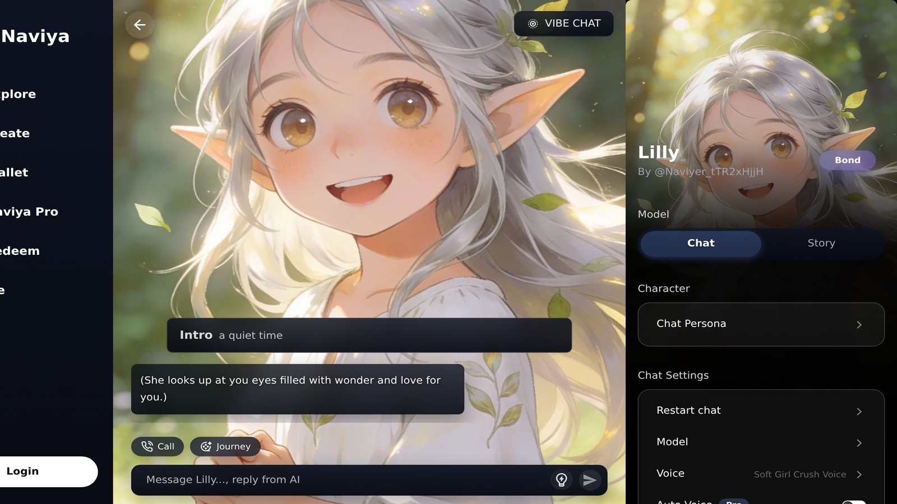

# Best AI Chat Apps for Tabletop Game Masters

Every tabletop GM I know is balancing lore bibles, encounter math, and last-minute player curveballs, so finding the right AI chat for tabletop prep can be the difference between improvising confidently and panic-googling in the middle of a session. This guide reviews the top AI companions that actually help game masters in 2026 — not just generic chatbots, but tools built to summarize rules, spin up NPC banter, and track consequences over a long campaign. The primary question: which AI chat app for tabletop groups keeps the story grounded without spoiling your creative control?

## What Tabletop GMs Need From AI Chat Apps

The best tools nail a few fundamentals:

- **Lore retention** so callbacks stick through multi-month arcs.
- **Fast prompt templates** tuned for NPC dialogue, handouts, and item descriptions.
- **Rules awareness** that references SRDs or homebrew frameworks without infringing IP.
- **Safety controls** for content boundaries set by your table.

A 2025 [Dicebreaker poll of 2,000 dungeon masters](https://www.dicebreaker.com/categories/tabletop-roleplaying-game/features/ai-tools-for-game-masters) reported that 61% experiment with AI to reduce prep time, but only 24% kept the tools because they lacked campaign context. That means knowledge management remains the key differentiator. Apps that let you build characters, scenes, and safety presets — like Naviya — stick around longer.

## Naviya: Session-Focused AI Cast

Naviya's roster of 10,000+ characters already spans tacticians, merchants, inventors, and cosmic entities. More importantly for GMs, the platform lets you create an entire cast for your campaign, tag them with factions, and open conversations mid-session from the mobile app. Each character can reference private lore files, so secret society motives stay hidden even if your players rummage through transcripts.

- **Prep perks**: Upload cultural primers, drop in city maps, and attach d100 tables right inside the profile.
- **Live improvisation**: Switch characters within a single chat, then pin the transcript to reuse jokes and clues later.
- **Shareable NPCs**: Publish a read-only link inside the [Naviya characters library](https://naviya.chat/characters) so co-GMs or backup hosts know who's who.

**Need to spin up a tavernkeeper right now? [Create a fresh NPC in Naviya](https://naviya.chat/create)** and test them in the chat sandbox. Pair it with the [feature overview](https://naviya.chat/features) to activate voice chat or image descriptions before the next session. When your party is ready to download the companion app, point them to the [official Naviya download page](https://naviya.chat/download) and share your campaign invite code.

## Loreweaver Relay

Loreweaver Relay earned its reputation for generative lore packs tailored to tabletop campaigns. You feed it your map plus a one-paragraph theme and it spits out regional rumors, faction goals, and NPC prompts with light stat blocks. The app tracks "tension" values; when players ignore a plotline, Relay automatically escalates consequences. Relay also integrates calendars so you can mark downtime activities and let the AI suggest training montages or rival moves.

Limitations: Relay's chat window refreshes every 200 messages, so you must export transcripts often. It also lacks native art tools, meaning you'll rely on other apps for NPC portraits.

## Squire AI

Squire AI aims to be the "evergreen co-GM" that knows core SRDs plus a curated list of indie systems. Ask for a Level 7 encounter using swamp terrain and Squire responds with stat suggestions plus narrative prompts. During live sessions, its "Stage Whisper" mode surfaces bullet-point hints without flooding your screen — perfect if you juggle VTT controls. Squire's premium tier unlocks integration with Notion and Obsidian, letting you push chat snippets straight into your campaign wiki.

Onboarding takes patience. Squire wants tags for every NPC, region, and plotline, which can feel like paperwork. Yet once you're over the hump, it becomes a serious prep accelerator.

## Storybloom Chronicle

Storybloom Chronicle doubles as a writing partner and moodboard generator. The chat app features a "GM Notebook" panel for clocks, secrets, and foreshadowing seeds. Chronicle also generates location ambience prompts and Spotify playlist ideas to match the tone of each scene. Couples or friend groups that co-GM appreciate Chronicle's collaborative comments, which allow you to debate an NPC's motivation inside the app before revealing anything to players.

The downside: Chronicle caps free accounts at three campaigns and 2,000 chat turns per month. Upgrade if you're running weekly tables.

## Reroll Nexus

Reroll Nexus evolved from the visual character sheet app. Now, its AI chat extends directly from those sheets, so every NPC you build comes with a persona prompt, portrait, and background music suggestion. Nexus fuses dice rollers into the chat, making it easy to test skill challenges right there. The devs also rolled out "GM Observers," little bots that monitor tone and pacing, then nudge you if a scene drags.

Because Nexus is art-first, text prompts can feel shallow. Expect to copy custom lore from your wiki to keep conversations grounded.

## How Naviya Fits Into Hybrid Tables

Most tables aren't 100% virtual or 100% in-person anymore. Naviya thrives in hybrid setups because you can run it on a spare tablet and pass it around as an NPC hotline. Build your roster ahead of time and share the link to the [characters gallery](https://naviya.chat/characters), then let players request cameos on the fly. The app's offline cache stores the most recent dialogue, so even if your venue has spotty Wi-Fi you can keep roleplay moving.

Naviya's create flow includes "Session Mode" — a toggle that shortens responses and keeps jokes PG. It's ideal for conventions or school clubs. Combine that with the analytics inside the [features page](https://naviya.chat/features), which shows how often each NPC appears; retire the ones that aren't hitting and double down on fan favorites.

## Collaboration Tips for Co-GMs

1. **Define safety signals**: Even with content filters, set real-world cues for topics to avoid. Document them inside each character's guideline block.
2. **Rotate ownership**: Assign one GM per major NPC so their voice stays consistent, then use Naviya's private notes field to drop future plot hooks.
3. **Share CTAs with players**: Encourage players to bookmark your NPC roster via the [download page](https://naviya.chat/download) so they can chat between sessions without overloading you.
4. **Use templates**: Build baseline prompts for quest givers, rival adventurers, and merchants. Save them as drafts inside the [Naviya create flow](https://naviya.chat/create) for quick duplication.

## Budget and Access Considerations

Several AI chat apps launched waitlists in 2024 after GPU shortages, but most have stabilized. Reroll Nexus still limits daily sign-ups, while Loreweaver sells only seasonal licenses. Naviya remains open — sign in with email or Apple/Google ID and you're building within minutes. For premium tiers, price them like you would a new sourcebook: ask whether the time saved equals at least one fewer prep night per month.

External reports such as [Gartner's analysis of generative AI in game development](https://www.gartner.com/en/articles/how-generative-ai-is-transforming-game-development) suggest teams that integrate AI into toolchains early see 20-30% faster production cycles. Translate that to tabletop: less crunch, more time for improvising character beats.

## Sample Session Workflow: Mystery Heist Night

Here's how a typical two-hour session runs when I combine Naviya with Loreweaver and Squire:

1. **Prep (20 minutes)**: I open the [Naviya create flow](https://naviya.chat/create) to duplicate last week's NPCs, adjust their motives, and regenerate portraits for disguise scenes. While portraits batch, Loreweaver drafts three rumors that foreshadow today's heist.
2. **Touchpoint check (10 minutes)**: Squire calculates guard patrols and encounter balance. I paste those notes into Naviya's private memory slots so the characters "know" the stakes without revealing DCs to players.
3. **Live play (90 minutes)**: Players interrogate suspects through Naviya chats on a spare tablet. When someone asks about a minor gang lieutenant, I swap to that NPC's tab and let them answer in-character. If the table needs a clue, I prompt Loreweaver for "consequence escalations" and feed the best one into the NPC's next response.
4. **Wrap-up (10 minutes)**: Export transcripts from Naviya, label them "Episode 14", then upload to our shared [features dashboard](https://naviya.chat/features) so co-GMs review analytics and see which NPCs earned the most interactions.

This workflow ensures AI supports improvisation rather than dictating it. Players still drive action, while the apps keep me organized.

## Should Every Table Use AI?

Not necessarily. If your group thrives on pure improvisation, you might only need a searchable SRD. But if you're juggling multiple campaigns, remote players, or educational objectives, AI co-GMs can keep continuity intact. Treat these apps as assistants, not narrators. Let them pitch flavor text, then edit it to match your tone.

## Final Recommendation

Pair Naviya with one specialized utility: Naviya covers roleplay depth, while Squire handles crunchy stat math or Loreweaver automates rumor tables. That combo keeps you nimble without drowning in subscriptions.

**Want to see how Naviya's NPC roster feels at your table? [Download the app and try a test session](https://naviya.chat/download)** — the free tier includes unlimited chats with your custom characters plus curated templates for taverns, rival adventurers, and cosmic patrons.
