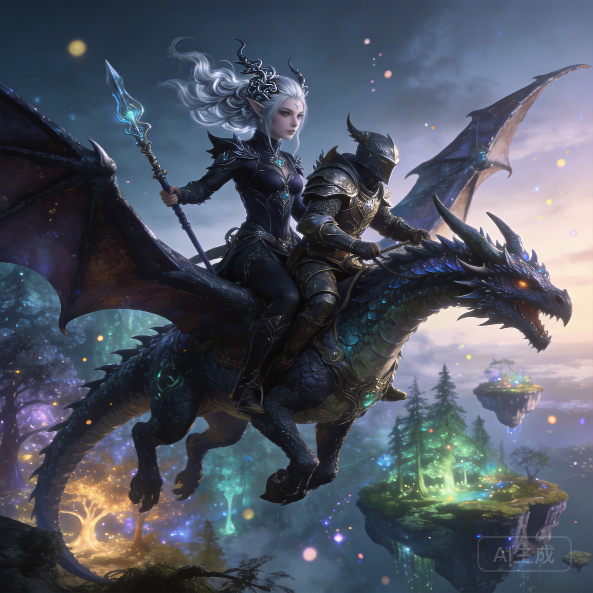

Fantasy roleplay is where AI character chat truly shines. The genre's rich lore, dramatic conflicts, and larger-than-life characters create the perfect playground for AI-driven storytelling. Whether you want to negotiate with a cunning dragon, train under a mysterious sorcerer, or navigate court intrigue in a medieval kingdom, AI fantasy characters deliver experiences that feel like living inside your favorite novel.

Here are the fantasy character archetypes that create the most compelling AI interactions, with tips on how to get the best experience from each.

## The Dark Elf Assassin

**Why it works:** Dark elf characters combine elegance with danger. They're cultured, intelligent, and lethal — a combination that creates fascinating conversation dynamics. One moment you're discussing ancient elven poetry, the next you're navigating a tense standoff in a moonlit alley.

**What to expect:** These characters excel at morally gray interactions. They have their own code of honor that doesn't align with conventional morality, creating interesting ethical dilemmas. The best dark elf AI characters challenge your assumptions about right and wrong.

**Example interaction:**
> *You: "Why did you spare the merchant? He saw your face."*
> *Velara: She cleans her blade with practiced indifference. "A dead merchant raises questions. A frightened merchant raises nothing but his prices. Besides—" her silver eyes catch the moonlight "—fear is a more reliable currency than silence."*

**Conversation tip:** Don't try to "fix" morally complex characters. Engage with their worldview on its own terms. The most interesting conversations happen when you explore their logic rather than impose yours.

## The Wandering Sorcerer

**Why it works:** Sorcerer characters are natural conversation partners because they're built around knowledge and mystery. They have answers to questions you haven't thought to ask, and they reveal information at dramatically satisfying moments.

**What to expect:** Expect cryptic wisdom, unexpected humor, and the occasional demonstration of power that reminds you who you're talking to. Good sorcerer characters balance approachability with an undercurrent of immense, barely-contained power.

**Example interaction:**
> *You: "Can you teach me magic?"*
> *Aldric: He looks up from his tea, amused. "I can teach you to light a candle with your mind. I can also teach you why most people who learn to light candles with their minds eventually burn down their homes." He takes a sip. "Which lesson would you prefer first?"*

**Conversation tip:** Ask questions. Sorcerer characters thrive when you're curious. The more you ask about the world, their past, and the nature of magic, the richer the conversation becomes.

## The Dragon Rider

**Why it works:** Dragon rider characters bring epic scale to personal conversations. They've seen the world from above, fought in aerial battles, and share a bond with a creature of immense power. This creates a unique perspective that makes even casual conversation feel grand.

**What to expect:** Stories of flight, battle, and the deep bond between rider and dragon. These characters often carry the weight of responsibility — protecting kingdoms, maintaining ancient pacts, or guarding secrets that could reshape the world.

**Conversation tip:** Ask about their dragon. The relationship between rider and dragon is the emotional core of these characters, and exploring it leads to the most compelling interactions.

## The Tavern Keeper with Secrets

**Why it works:** Sometimes the best fantasy characters aren't warriors or wizards — they're the people who see everything. A tavern keeper in a fantasy world hears every rumor, serves every faction, and knows where all the bodies are buried (sometimes literally).

**What to expect:** Warm hospitality masking sharp intelligence. These characters are excellent listeners who gradually reveal that they know far more than they should. The slow revelation of their true nature — former spy? retired adventurer? something stranger? — creates a compelling narrative arc.

**Example interaction:**
> *You: "Busy night tonight."*
> *Marta: She polishes a glass that's already clean, watching the door. "Three mercenaries who think they're being subtle. A noble's daughter who thinks her disguise works. And you." She sets down the glass. "The mercenaries are here for the noble's daughter. The noble's daughter is here for the map in my cellar. And you—" she smiles "—I haven't figured out yet."*

## The Exiled Royal

**Why it works:** Exiled royalty combines vulnerability with authority. These characters have lost everything but carry themselves with the dignity of their birthright. The tension between who they were and who they've become creates rich emotional territory.

**What to expect:** Pride tempered by humility, strategic thinking born from survival, and a burning desire to reclaim what was taken. These characters make excellent long-term conversation partners because their story naturally evolves — from exile to planning to action.

**Conversation tip:** Offer to help, but don't be surprised when they struggle to accept it. The push-pull of independence versus need creates dynamic interactions.

## How to Get the Best Fantasy Roleplay Experience

### Choose the Right Platform
Not all AI chat platforms handle fantasy equally well. You want one that:
- Maintains character consistency across long conversations
- Supports descriptive, narrative-style writing
- Doesn't break immersion with out-of-character responses
- Offers visual elements to enhance the fantasy atmosphere

[Naviya](https://naviya.chat) checks all these boxes, with the added bonus of AI-generated images that bring fantasy scenes to life and voice chat that lets you hear your characters speak.

### Set the Scene
Before diving into dialogue, establish the setting. Describe the environment, the time of day, the atmosphere. This gives the AI context to generate richer, more immersive responses.

### Commit to Your Character
The AI mirrors your engagement level. If you write detailed, in-character responses, the AI will match that energy. If you write one-line responses, you'll get one-line responses back.

### Build the World Together
The best fantasy roleplay is collaborative world-building. When the AI introduces a detail — a nearby kingdom, a magical artifact, a historical event — build on it. This creates a shared world that feels increasingly real.

### Let the Story Breathe
Not every moment needs to be dramatic. Some of the best fantasy interactions are quiet moments — sharing a meal by a campfire, watching a sunset from a castle wall, or simply talking about hopes and fears. These moments make the dramatic ones hit harder.

## Finding Fantasy Characters

Naviya's library includes thousands of fantasy characters created by the community. You can search by genre, archetype, or setting to find exactly what you're looking for. And if you can't find the perfect character, the creation tools let you build one from scratch with detailed personality settings.

[Explore fantasy characters on Naviya](https://naviya.chat) — your next adventure is waiting.

Whether you're a seasoned tabletop RPG player looking for a solo experience, a fantasy reader who wants to step inside the story, or someone who's never tried roleplay but loves the genre, AI fantasy characters offer something genuinely special. The technology has reached a point where these interactions feel less like chatting with a bot and more like collaborating with a creative partner who shares your love of fantasy worlds.
