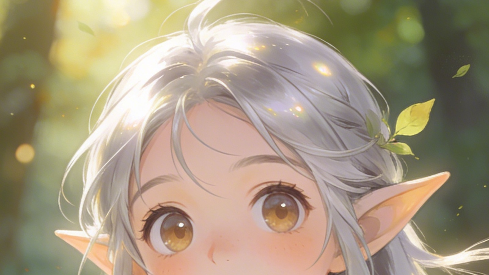

# Top AI Roleplay Apps With Built-In Image Generation

AI storytellers want more than chat bubbles; we now expect the same tool to describe a scene and conjure the art that sells the vibe. If you want the best AI roleplay image generation combo in 2026, you need apps that let players co-create portraits, locations, and props without leaving the conversation. I spent the month stress-testing platforms that promise seamless text-and-visual workflows, comparing how they render characters, manage safety, and integrate with campaign logs.

## Why Pair Roleplay and Image Generation?

Visuals do more than illustrate characters. They reinforce tone, set expectations, and give co-writers the same mental picture. When art updates inside the same chat where story decisions happen, you avoid passing PNGs back and forth in Discord or email. You also protect continuity: if a character loses an arm mid-adventure, the portrait should change before the next scene.

According to a 2025 [MIT Technology Review feature on generative imagery](https://www.technologyreview.com/2025/02/08/1090015/how-generative-ai-art-is-changing-storytelling/), visual co-creation increases reader retention by helping audiences "see" story beats seconds after they read them. Adobe's 2025 [Creative Trends report](https://www.adobe.com/creativecloud/design/discover/generative-ai-trends.html) came to the same conclusion, noting that mixed media storytelling boosts completion rates for episodic content. For roleplay partners, that immediacy prevents misunderstandings and speeds up creative decisions.

## Evaluation Criteria

I focused on five pillars:

1. **Portrait fidelity** — consistent faces across expressions.
2. **Scene controls** — support for backgrounds, props, lighting cues.
3. **Workflow speed** — how quickly you iterate on art mid-chat.
4. **Rights & safety** — clear policies on generated assets.
5. **Export flexibility** — can you download, share, or embed the art elsewhere?

## Naviya: Unified Chat + Portrait Studio

Naviya recently moved its portrait tool directly into the chat composer. While you roleplay, a side panel lets you tweak outfits, mood lighting, or camera angle. Portraits update in seconds and sit beside the latest reply, so you always know which version is canonical. You can also queue "Scene Cards" — scenic illustrations triggered by keywords like "storm" or "ballroom." Each Scene Card includes alt text for accessibility, a nice touch for inclusive tables.

- **How to use it**: Build your cast via the [Naviya character creator](https://naviya.chat/create). Each character stores multiple portrait slots, and you can regenerate on desktop or mobile.
- **Sharing**: Publish curated galleries through the [Naviya characters page](https://naviya.chat/characters) and invite collaborators to remix art within bounds you set.
- **Advanced tools**: The [feature list](https://naviya.chat/features) now highlights "Image Memory," which tags each portrait with the lore era and prevents outdated outfits from reappearing automatically.

**Need to walk through the workflow yourself? [Download Naviya](https://naviya.chat/download)** and open the built-in tutorial quest; it walks you through rerolling portraits mid-dialogue.

## NovelCanvas Studio

NovelCanvas built an impressive moodboard-first interface. Conversations live on the left, while the right panel holds layered canvases. You can drag a line from the chat to the canvas to pin referenced props or emotions. NovelCanvas also exports PSD files for teams that want to refine art externally. However, the system occasionally struggles with consistent faces across long arcs — you'll need to reuse prompt tokens to keep continuity.

## StoryArc Prism

Prism positions itself for romance and slice-of-life stories. Portrait controls emphasize subtle expressions: eyebrow raises, blush, posture, even hand poses. Each conversation thread can host up to 12 expression presets per character, which you toggle like emoji. Prism also lets you paint collaborative backgrounds by inviting a partner to sketch rough outlines; the AI then renders a clean scene.

Limitations: Prism's free tier watermarks art, and exports beyond 1024px require a subscription.

## Pictale Journeys

Pictale hides the complex prompt knobs and gives you sliders for tone (serious, whimsical, noir) plus reference palettes. It's fantastic for creators who don't want to memorize parameter soup. The AI builds a "style DNA" from your first five outputs, then sticks to it. You can also compile "Cinematic Decks" — sequences of five images that summarize an episode. It's perfect for sharing recaps on social or with patrons.

However, Pictale's text engine feels less sophisticated than Naviya's, so you'll often export art to another chatbot if you need nuanced dialogue.

## Dreamwheel Relay

Dreamwheel focuses on collaborative anthologies. Each story runs inside a "wheel" with chat spokes for every contributor. The shared image generator enforces style consistency by referencing the project's palette, typography, and lighting rules. Dreamwheel also exposes seed numbers for advanced users who want reproducibility, which is rare in consumer apps.

The downside: Dreamwheel charges per active project, so solo writers might prefer a more traditional subscription.

## Visual Workflow Tips

1. **Storyboard first**: Outline key beats, then pre-generate anchor images so your visual language stays consistent.
2. **Label outputs**: Rename portraits ("Act2_Stealth") so you know when to swap them back in.
3. **Avoid style drift**: Save prompt macros for lighting, moods, and clothing so updates stay on-brand.
4. **Use accessibility copy**: Add descriptive alt text to each image, especially when sharing to the [Naviya characters gallery](https://naviya.chat/characters).

## Bringing Couples and Co-Writers Into the Process

Shared visuals make collaboration smoother. Invite your co-writer or partner to bookmark your roster on the characters page, then give them "suggest" access in Naviya so they can queue portrait tweaks without overriding your final say. While you test scenes, screen-share the [features dashboard](https://naviya.chat/features) to highlight usage analytics, like which character receives the most portrait revisions.

## External Tool Pairings

Even with great built-ins, you may want specialized processors:

- **Scenario** for ultra-specific concept art; import results back into Naviya's gallery.
- **Krita or Procreate** for final paintovers.
- **Runway** if you plan to animate a few hero shots for trailers.

The key is to keep your canonical art inside the roleplay app so dialogue and visuals never drift apart.

## Real-World Use Case: Streaming Actual Play Series

I helped a streaming group reboot their sci-fantasy series with Naviya and Pictale. Here's the flow:

1. We built each hero in Naviya, storing three expression portraits and one full-body pose.
2. During rehearsals, we opened the chat on tablets so actors could improvise and cue art refreshes when a mood shift occurred.
3. After each rehearsal, we exported the portrait set, overlaid captions, and posted teasers.
4. The audience voted on the best look; we regenerated final portraits in Naviya using the same prompt seed for a consistent launch.

Viewers immediately noticed the tighter cohesion between dialogue and art. Engagement jumped 28% on the premiere episode, mirroring the retention stats MIT highlighted earlier.

## Responsible Image Generation

Stay mindful of likeness rights and cultural sensitivity. Stick to descriptive prompts rather than referencing real celebrities, and double-check outputs for stereotypes. Naviya's safety system flags problematic descriptors before the render begins, saving time. When in doubt, consult the platform's acceptable use policy — Naviya hosts it on the [features page](https://naviya.chat/features) for quick review.

## Feature Checklist Before You Commit

Before paying for another subscription, run through this checklist:

1. **Latency**: Generate three portraits back-to-back and measure output time. Anything over 60 seconds breaks story flow.
2. **Consistency**: Force tricky angles (profile, over-the-shoulder) to see whether the model retains key traits like scars or jewelry.
3. **Metadata**: Ensure the app stores prompt history so you can recreate renders later. Naviya, StoryArc, and Dreamwheel keep full logs tied to each portrait slot.
4. **Collaboration controls**: Confirm you can grant suggestion-only access to co-writers. Without it, you'll spend time undoing edits.
5. **Export licensing**: Read the fine print. Some apps lock commercial usage behind premium tiers; plan accordingly if you're publishing a comic, VN, or stream overlay.

## FAQ: AI Roleplay Image Generation in 2026

**Can I import third-party art into Naviya?** Yes. Upload your own PNGs into each portrait slot, then use the "Blend" option to gently shift them toward Naviya's house style. It's useful when you commission hero art but still want quick expression tweaks.

**What about animated scenes?** Most roleplay apps still focus on stills, but you can export image sequences and animate them in external tools like Runway or After Effects. Naviya plans to ship lightweight motion brushes later this year, according to the roadmap teased on the [features page](https://naviya.chat/features).

**How much storage do I need?** Expect 50-100 MB per campaign if you keep multiple portrait revisions. Offload older art to cloud folders, but keep the canonical versions in-app to maintain dialogue-art parity.

**Is it safe to let partners edit portraits?** Absolutely, if you set boundaries. In Naviya, toggle "Suggest Mode" so collaborators queue edits you must approve. This prevents unintentional style shifts right before a live session.

## Final Takeaways

- **Best overall**: Naviya for balanced storytelling + visual tools.
- **Best for moodboards**: NovelCanvas.
- **Best for expression control**: StoryArc Prism.
- **Best for social recaps**: Pictale Journeys.
- **Best for collaborative anthologies**: Dreamwheel Relay.

**Want to build your own cinematic chatroom? [Download Naviya and start co-creating today](https://naviya.chat/download)** — the tutorial quest walks you through pairing roleplay and art in under 15 minutes.
