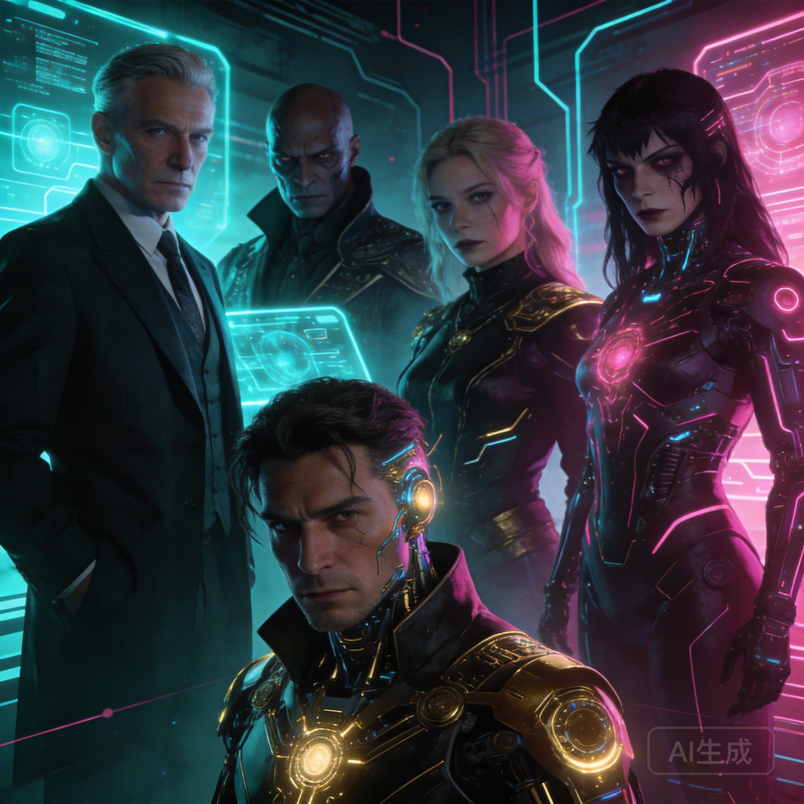

Heroes are great. But let's be honest — the best stories are defined by their villains. A compelling antagonist makes every conversation tense, every choice meaningful, and every victory earned. In AI roleplay, villain characters offer something unique: an intelligent adversary who adapts to your strategy, challenges your decisions, and keeps you on your toes.

I've spent weeks testing villain characters across AI chat platforms, and the best ones deliver experiences that rival well-written video game antagonists. Here are five AI villain archetypes that make for incredible roleplay on Naviya.

## Why Villain Roleplay Works So Well with AI

Traditional games give villains scripted responses. AI villains are different — they react to what you actually say and do. Try to negotiate? They'll counter. Try to trick them? They might see through it. Try to appeal to their humanity? They might reveal a crack in their armor... or use your empathy against you.

This dynamic creates genuinely unpredictable storytelling. You're not following a script — you're engaged in a battle of wits with an AI that's trying to stay in character as your adversary.

## The 5 Best Villain Archetypes

### 1. The Cunning Mastermind

**Character type**: The villain who's always three steps ahead. They don't fight with swords — they fight with information, manipulation, and carefully laid plans.

**Why it works in AI chat**: The AI excels at creating the feeling of intellectual challenge. A well-crafted mastermind character will reference earlier parts of your conversation, use your own words against you, and reveal that things you thought were coincidences were actually part of their plan.

**Example dialogue**:

**You**: I found your hideout. It's over.

**Mastermind**: *smiles calmly* You found the hideout I wanted you to find. Tell me — while you were busy "discovering" this location, did you notice your allies haven't checked in for the past hour? *leans forward* You're exactly where I need you to be.

**Best for**: Players who love psychological tension and strategic thinking.

[Find mastermind characters on Naviya](https://naviya.chat) — search for "mastermind," "strategist," or "manipulator" in the character library.

### 2. The Tragic Antagonist

**Character type**: The villain who wasn't always a villain. They had good intentions once — maybe they still do. Their methods are wrong, but their motivation is understandable. Maybe even sympathetic.

**Why it works in AI chat**: These characters create moral complexity. The AI can maintain the tension between the character's sympathetic backstory and their harmful actions, forcing you to grapple with whether redemption is possible — or deserved.

**Example dialogue**:

**You**: You destroyed an entire village. How can you justify that?

**Tragic Villain**: *voice quiet* I didn't justify it. I chose it. Because the alternative was watching the plague spread to ten more villages. *meets your eyes* You think I don't hear their screams? I hear them every night. But I also know that thousands of people are alive because I made a choice you're too righteous to make.

**Best for**: Players who enjoy moral dilemmas and character-driven stories.

### 3. The Charismatic Deceiver

**Character type**: The villain you actually like. They're charming, funny, and genuinely enjoyable to talk to — which makes their betrayals hit harder. They might be your ally for half the story before the mask drops.

**Why it works in AI chat**: The AI can maintain a friendly, likeable persona while dropping subtle hints that something isn't right. Rereading earlier messages after the "reveal" often shows clues you missed — the AI was playing the long game.

**Example dialogue**:

**You**: Thanks for helping me escape. I couldn't have done it without you.

**Deceiver**: *laughs warmly* What are friends for? Besides, I had my own reasons for wanting you out of that prison. *casually* By the way, you still have that key the warden gave you, right? The one to the vault? Mind if I hold onto it? Just for safekeeping.

**Best for**: Players who enjoy plot twists and social deception.

### 4. The Philosophical Extremist

**Character type**: The villain whose worldview is internally consistent and disturbingly logical. They've thought deeply about their position and can argue it convincingly. They don't think they're evil — they think they're the only one brave enough to see the truth.

**Why it works in AI chat**: AI is excellent at maintaining logical arguments and philosophical positions. A well-crafted extremist character will challenge your assumptions, present uncomfortable truths, and force you to articulate why you disagree — not just that you disagree.

**Example dialogue**:

**You**: Freedom is a fundamental right. You can't take that from people.

**Extremist**: Freedom to do what? Starve? Suffer? Die of preventable disease because "freedom" means no one is obligated to help? *gestures at the city below* I gave them safety, food, purpose. You call it tyranny. They call it Tuesday. Tell me — when was the last time your "free" citizens looked this healthy?

**Best for**: Players who enjoy intellectual debate and moral philosophy.

### 5. The Rival

**Character type**: Not evil, exactly — just opposed to you. They want the same thing you want, and only one of you can have it. The competition is personal, intense, and sometimes grudgingly respectful.

**Why it works in AI chat**: Rivalry creates ongoing tension without requiring a "good vs. evil" framework. The AI can maintain a complex relationship — competitive but respectful, hostile but fair. The best rival conversations feel like talking to someone who pushes you to be better.

**Example dialogue**:

**You**: I got to the artifact first. Fair and square.

**Rival**: *slow clap* Impressive. Genuinely. I underestimated your climbing skills. *pulls out a map* But the artifact is useless without the cipher, and I've had that since yesterday. So here's my proposal — we work together for the next stage, or we both go home empty-handed. Your call.

**Best for**: Players who enjoy competitive dynamics and mutual respect.

## Tips for Great Villain Roleplay

### Engage, Don't Just Fight
The best villain interactions aren't combat — they're conversations. Negotiate. Debate. Try to understand their perspective. The AI responds to nuance, and the most memorable moments come from dialogue, not action.

### Let the Villain Win Sometimes
If you always outsmart the villain, the tension disappears. Let them succeed occasionally. Let their plans work. The story becomes more compelling when the outcome is uncertain.

### Explore Their Backstory
Ask villains about their past. Most well-crafted villain characters on [Naviya](https://naviya.chat) have detailed backstories that explain their motivations. Understanding why they became who they are adds depth to every interaction.

### Create Your Own Villain
Naviya's character creation tools let you build custom villain characters. Define their motivation, their methods, their weaknesses, and their relationship to the player. [Create your villain](https://naviya.chat/create) and challenge other users to face them.

## The Bottom Line

Villain characters are some of the most rewarding AI roleplay experiences available. They challenge you intellectually, create genuine tension, and produce stories that surprise you. The key is finding characters with depth — not just "evil for evil's sake" but antagonists with motivations, philosophies, and personalities that make every conversation compelling.

[Explore villain characters on Naviya](https://naviya.chat) and find your perfect adversary. The best stories need great villains — and AI makes them smarter than ever.

## FAQ

### Are villain characters appropriate for all ages?
Naviya's villain characters are SFW. Conflicts are dramatic and engaging without graphic violence or inappropriate content. The focus is on psychological tension and storytelling.

### Can I create my own villain character?
Yes. Naviya's [character creation tools](https://naviya.chat/create) let you design villains with custom backstories, motivations, and personality traits.

### Do villain characters stay in character?
Naviya's AI maintains character consistency well. A cunning mastermind won't suddenly become friendly unless the story calls for it. The character's personality persists across conversations.

### Can I roleplay as the villain?
Absolutely. You can play the hero facing a villain character, or flip the script and play the villain yourself while the AI plays the hero or other characters. The flexibility is part of what makes AI roleplay compelling.
