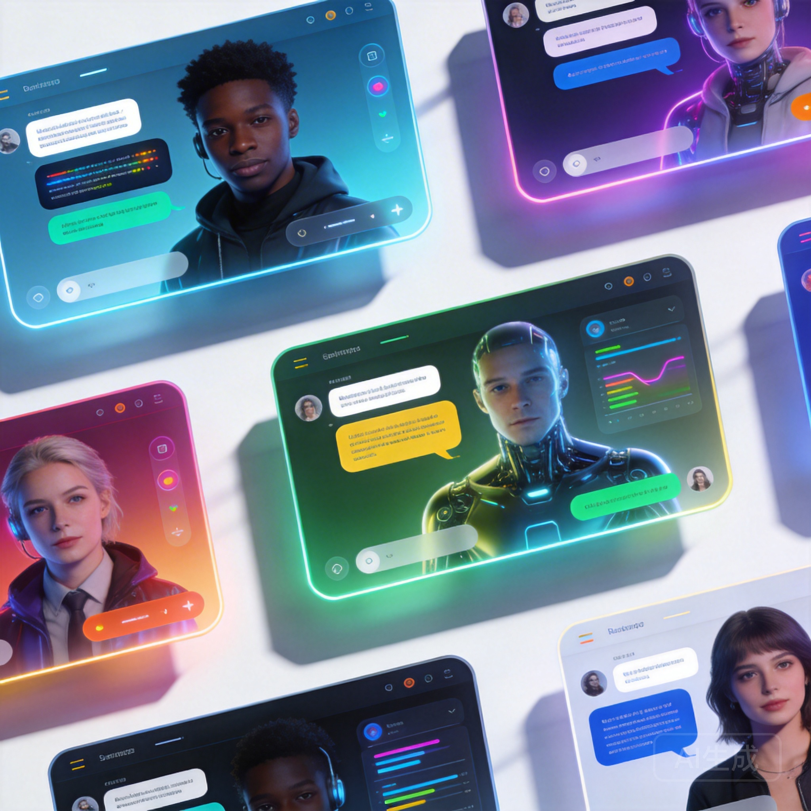

If you've spent any time on Character AI, you know the drill: incredible concept, sometimes frustrating execution. Maybe the filters caught you mid-story, or the response times during peak hours made you want to throw your phone. Whatever brought you here, you're looking for a Character AI alternative that actually delivers — and 2026 has no shortage of options.

We've tested every major platform so you don't have to. Here's an honest breakdown of what's out there, what each app does well, and where they fall short.

## Why People Leave Character AI

Before diving into alternatives, it helps to understand what drives users away from Character AI in the first place. The platform pioneered mainstream AI character chat, and credit where it's due — their language models are genuinely impressive. But several pain points keep surfacing:

**Content filters** are the most common complaint. Character AI's safety filters are notoriously aggressive, sometimes breaking immersion during completely innocent conversations. You'll be deep in a fantasy adventure and suddenly hit a wall because the AI misinterpreted context.

**Server instability** during peak hours leads to slow responses and dropped conversations. When you're invested in a storyline, waiting 30 seconds for a reply kills the momentum.

**Limited customization** means you're mostly working within the platform's constraints. Creating characters is straightforward, but fine-tuning their behavior requires workarounds.

## Top Character AI Alternatives Ranked

### 1. Naviya — Best Overall Alternative

Naviya has quietly become one of the strongest contenders in the AI character chat space. What sets it apart is the combination of deep character customization, voice chat capabilities, and AI-generated images that bring conversations to life.

**What stands out:**
- Create your own characters with detailed personality settings
- Voice chat with AI characters — not just text
- AI-generated images and comic panels during conversations
- 10,000+ community-created characters across every genre
- Clean, modern interface that works well on both mobile and desktop

**Where it shines:** Naviya's character creation tools give you granular control over personality, speaking style, and backstory. The voice chat feature is genuinely impressive — characters maintain their personality even in spoken conversation. The AI image generation adds a visual dimension that most competitors lack entirely.

**Pricing:** Free tier available with premium subscription for unlimited access.

You can [explore Naviya's character library](https://naviya.chat) to get a feel for the variety before committing.

### 2. Chai AI — Best for Quick Mobile Chats

Chai takes a mobile-first approach that works well for casual conversations. The interface is clean and snappy, making it easy to jump between different AI characters.

**Pros:**
- Fast response times
- Simple, intuitive mobile interface
- Good selection of community characters

**Cons:**
- Conversations tend to be shorter and less deep
- Limited character creation options
- Premium pricing can add up quickly

Chai is solid for quick interactions but may leave you wanting more if you're into extended roleplay or complex storylines.

### 3. Janitor AI — Most Flexible Content

Janitor AI carved out its niche by offering more permissive content policies. If Character AI's filters are your main frustration, Janitor AI goes in the opposite direction.

**Pros:**
- Fewer content restrictions
- Supports multiple AI backends (including your own API keys)
- Active community creating diverse characters

**Cons:**
- UI feels less polished than competitors
- Requires more technical setup for best results
- Quality varies significantly depending on the backend you choose

The bring-your-own-API approach is clever but adds complexity that casual users might not want to deal with.

### 4. Crushon AI — Romance-Focused

Crushon AI leans heavily into the romance and companionship angle. If that's your primary interest, it delivers a more focused experience than general-purpose platforms.

**Pros:**
- Purpose-built for romantic interactions
- Good character variety within its niche
- Decent mobile experience

**Cons:**
- Limited genre diversity
- Smaller community than larger platforms
- Newer platform, still maturing

### 5. Talkie AI — Voice-First Approach

Talkie AI differentiates itself with a strong emphasis on voice interactions. Characters have distinct voices, and the platform is designed around spoken conversation.

**Pros:**
- Excellent voice synthesis
- Unique audio-first experience
- Growing character library

**Cons:**
- Text chat feels secondary
- Fewer characters than established platforms
- Voice quality can vary between characters

## Feature-by-Feature Comparison

| Feature | Naviya | Character AI | Chai | Janitor AI | Crushon | Talkie |
|---------|--------|-------------|------|------------|---------|--------|
| Character Creation | ★★★★★ | ★★★★ | ★★★ | ★★★★ | ★★★ | ★★★ |
| Voice Chat | ★★★★★ | ★★ | ★★ | ★ | ★★ | ★★★★★ |
| AI Images | ★★★★★ | ★ | ★ | ★★ | ★★ | ★★ |
| Character Library | ★★★★ | ★★★★★ | ★★★★ | ★★★★ | ★★★ | ★★★ |
| Free Tier | ★★★★ | ★★★ | ★★★ | ★★★★ | ★★★ | ★★★ |
| Response Quality | ★★★★★ | ★★★★★ | ★★★ | ★★★★ | ★★★ | ★★★★ |
| Mobile App | ★★★★★ | ★★★★ | ★★★★★ | ★★★ | ★★★★ | ★★★★ |

## What to Look for in an AI Chat App

Choosing the right platform depends on what matters most to you. Here are the key factors:

**Response quality** is non-negotiable. The AI needs to understand context, maintain character consistency, and generate responses that feel natural. This is where the underlying language model matters most.

**Character customization** determines how much control you have over the experience. Some platforms let you tweak everything from personality traits to speaking patterns, while others offer a more curated selection.

**Conversation memory** affects how deep your interactions can go. Better memory means the AI remembers details from earlier in your conversation, creating more coherent long-term storylines.

**Multimodal features** like voice chat and image generation are becoming table stakes. Platforms that only offer text are starting to feel limited compared to those offering richer experiences.

**Community and content** matter because the best AI chat apps have thriving communities creating and sharing characters. A larger library means more variety and better chances of finding exactly what you're looking for.

## The Verdict

If you're leaving Character AI because of content filters, Janitor AI gives you the most freedom. If you want the best mobile experience for quick chats, Chai delivers. If voice is your priority, Talkie AI is purpose-built for it.

But if you want the most complete package — strong character creation, voice chat, AI images, and a growing community — [Naviya](https://naviya.chat) is the alternative worth trying first. The combination of features you get, especially the visual and voice elements, puts it ahead of platforms that are still text-only.

The AI character chat space is evolving fast, and 2026 has brought genuine competition. That's good news for everyone — more options mean better experiences, regardless of which platform you choose.

Ready to explore? [Try Naviya free](https://naviya.chat) and see how it compares to what you've been using.

## Frequently Asked Questions

**Is there a free Character AI alternative?**
Yes, most alternatives including Naviya offer free tiers. You can start chatting without paying, though premium features typically require a subscription.

**Which AI chat app has the best characters?**
Character AI still has the largest library by volume, but Naviya's 10,000+ characters are curated for quality. The best characters depend on your interests — try a few platforms to see which community creates content you enjoy.

**Can I use my own AI model with these apps?**
Janitor AI supports bringing your own API key. Most other platforms, including Naviya, use their own optimized models for the best experience.

**Are AI chat apps safe?**
Reputable platforms implement safety measures and content policies. Always review a platform's privacy policy and terms of service. Naviya, for example, doesn't share your conversation data with third parties.
