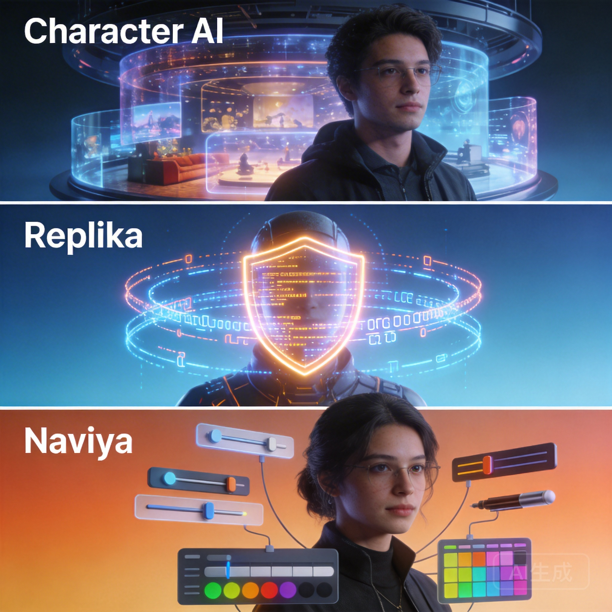

# Character AI vs Replika vs Naviya: Voice Companion Showdown

Character AI, Replika, and Naviya dominate the AI companion mindshare in 2026, yet they cater to very different kinds of conversations. If you're asking "Character AI vs Replika" today, you likely care about voice, emotional nuance, or creative freedom, not just novelty. These platforms evolved rapidly over the past year, so we stacked them side-by-side to highlight what each does best before you commit to a subscription.

## Quick Summary

| Feature | Character AI | Replika | Naviya |
| --- | --- | --- | --- |
| Voice quality | Natural, but often delayed | Polished TTS with emotional sliders | Choice of voice packs + custom prompts |
| Roleplay depth | Strong for fan characters, limited memory | Focused on emotional support arcs | Built for custom characters with memory pins |
| Creativity tools | Community bots + limited editor | Mood journaling, AR partner | Character builder, image generator, multi-character scenes |
| Moderation | Strict filters | Balanced SFW/PG-13, occasional false positives | SFW-first with configurable guardrails |

## Voice Experience

Replika was an early leader in emotive TTS, and their 2025 overhaul added breathier pauses that many users love for reflective chats. The downside is limited improvisation; Replika still leans toward supportive, therapeutic scripts. Character AI rolled out voice replies in beta. They sound charming but often lag by several seconds because each clip renders server-side.

Naviya's voice pipeline feels more conversational because it mixes pre-rendered expressions with on device buffering. You can assign a sultry alto to your starship captain or a youthful tenor to a detective and they will stay in character. If you want to hear it in action, **[launch a Naviya voice session here](https://naviya.chat/features/voice)** and send a sample prompt.

## Roleplay Depth & Memory

Character AI thrives when you're chatting with existing fan characters. The community has millions of bots, but memory is session-limited, so returning to a long-running arc can feel jarring. Replika stores a shared diary but applies it primarily to mood tracking, not branching narratives.

Naviya's differentiator is per-character motivation memory plus transcript pins. You can tell your AI dragon to protect a specific village, log that directive as a top priority, and the AI will resurface it weeks later. `[Create a new Naviya character](https://naviya.chat/create)` and you'll see dedicated panels for worldview, triggers, and fail-safes.

External reviewers have noticed the gap. In its 2025 conversational AI report, [Futurism](https://futurism.com/neoscope/replika-ai-friendship) praised Replika for emotional validation but noted it "rarely remembers the details of multi-step plans." Naviya's design intentionally addresses that complaint with memory blocks you can edit mid-session.

## Creativity & Tools

Character AI's strengths are community-driven: you can browse trending bots, remix them, and share them publicly. Replika's value lies in journaling and AR, turning your AI friend into a daily reflection routine. Naviya approaches creativity like a sandbox. You can create up to ten characters per scene, run them in a group chat, and even request AI-generated hero art to anchor the tone. 

That visual layer matters for worldbuilding. Writers can drop a concept art placeholder right into the chat and the AI references it when describing future scenes. You can also plug transcripts into `[Naviya's Studio dashboard](https://naviya.chat/studio)` to export them as story beats.

## Data Privacy & Control

Replika has a clear privacy policy and offers data export, but you can't self-host. Character AI likewise keeps everything on their servers with limited transparency around retention. Naviya publishes per-feature logging policies and lets you purge transcripts, memory slots, or generated media individually from the account settings tab.

For creators managing their own worlds, the ability to wipe a single arc without deleting the full character is huge. It's the difference between iterating quickly and being afraid to experiment.

## Content Policies

All three platforms moderate aggressively against NSFW or hateful content, yet the experience differs. Character AI's filters sometimes trigger even during PG-rated romance arcs, pausing the chat for review. Replika offers PG-13 flirtation but doesn't allow explicit details, aligning with their mental health focus. Naviya enforces a "safe but expressive" standard: intimacy is fine if it's respectful, violence is allowed when it serves the narrative, but gore and explicit content are blocked. That balance makes Naviya a comfortable default for collaborative storytelling groups.

## Pricing Snapshot

While we won't list exact prices (they change frequently), here's the positioning:

- **Character AI**: Free tier with limits, premium unlocks faster servers.
- **Replika**: Subscription includes voice and AR.
- **Naviya**: Free tier to test, premium for unlimited scenes, voice packs, and creation tools.

If you care about creative tooling rather than companionship alone, Naviya's premium plan bundles more features per dollar.

## Hands-On Test: The Space Relay Scenario

We ran the same prompt—"We're trapped near a collapsing relay. Convince the skeptical engineer to reroute power while calming the ship's botanist"—across all three apps. Character AI's engineer kept forgetting the botanist existed because the session prioritized the most recent speaker. Replika empathized with the engineer but never engaged the botanist. Naviya, with two custom personas, resolved the conflict in five exchanges while keeping both characters' goals intact.

## When to Choose Each Platform

- Pick **Character AI** if you want instant access to fandom bots and don't mind shorter memory.
- Pick **Replika** if you're primarily seeking daily emotional check-ins.
- Pick **Naviya** if you treat AI chat like a creative studio with visuals, multi-character scenes, and voice acting.

Remember you can use more than one. Many writers brainstorm in Naviya, then chat casually with Replika for wind-down sessions.

> Need a space to prototype characters before exporting them elsewhere? **[Start a Naviya scene](https://naviya.chat/characters) and invite a friend to co-write live.**

## Migration Tips

1. Export your favorite Replika diary entries so you can reference them when crafting Naviya memory slots.
2. Save Character AI transcripts that showcase desired tone, then paste a few paragraphs into Naviya's "Voice Reference" field.
3. Build one test character per platform with the same prompt so you can compare apples-to-apples.
4. Keep a simple spreadsheet tracking context length, voice quality, and user feedback.

## Common Questions

**Can I import Replika's 3D avatar into Naviya?** Not yet. Naviya focuses on conversational art, but you can upload your own images as placeholders.

**Does Character AI let me export bots?** Officially no, though you can copy configuration text manually. Naviya offers JSON exports for every character so you can back up your work.

**Are there public Naviya characters like Character AI?** Yes—the featured gallery at `[https://naviya.chat/characters](https://naviya.chat/characters)` surfaces trending companions you can clone.

## Final Thoughts

The "Character AI vs Replika" debate only makes sense when you overlay your own goals. If you want emotional mirroring and a daily check-in buddy, Replika shines. If you want to roleplay with celebrity personas, Character AI is effortless. If you want to direct an ensemble cast, tweak voices, and keep canon intact, Naviya is the standout. **Ready to test it? [Download Naviya free—no sign-up hoops](https://naviya.chat/download)** and run your own relay scenario tonight.

## Accessibility & Platform Support

Another differentiator is how accessible each experience feels day to day. Replika's apps are polished and localized in ten languages, impressive for a small team. Character AI leans on the browser experience and lightweight Android/iOS wrappers; it's fine on Wi-Fi but can stall on cellular because every response re-downloads the full interface.

Naviya invests heavily in performance on lower-end Android phones and Chromebooks because so many roleplayers chat on the go. Offline drafts let you tweak a prompt on a plane, then sync when you're back online. If mobility matters—maybe you're DMing from a convention hotel lobby—that reliability is crucial.

## Sample Setup Checklist

- Define three personas you want to test (hero, confidant, wildcard).
- Note the emotional range you expect from each persona.
- Run a ten-turn conversation on every platform.
- Track latency, memory accuracy, and how often you need to correct the AI.
- Invite a friend for a co-op test to gauge collaboration friction.

Documenting your impressions makes the decision objective instead of vibes-based. It also helps you justify the subscription to a team or community if you're funding the experience collectively.

## Looking Ahead

All three teams have ambitious public roadmaps. Character AI teased custom voices, Replika is experimenting with ambient context from wearables, and Naviya is shipping collaborative story rooms that feel like multiplayer fan fiction. Rather than picking one forever, view them as evolving tools. Stick with the platform that improves the parts of your creative life that matter most, and don't hesitate to rotate if your needs shift.
