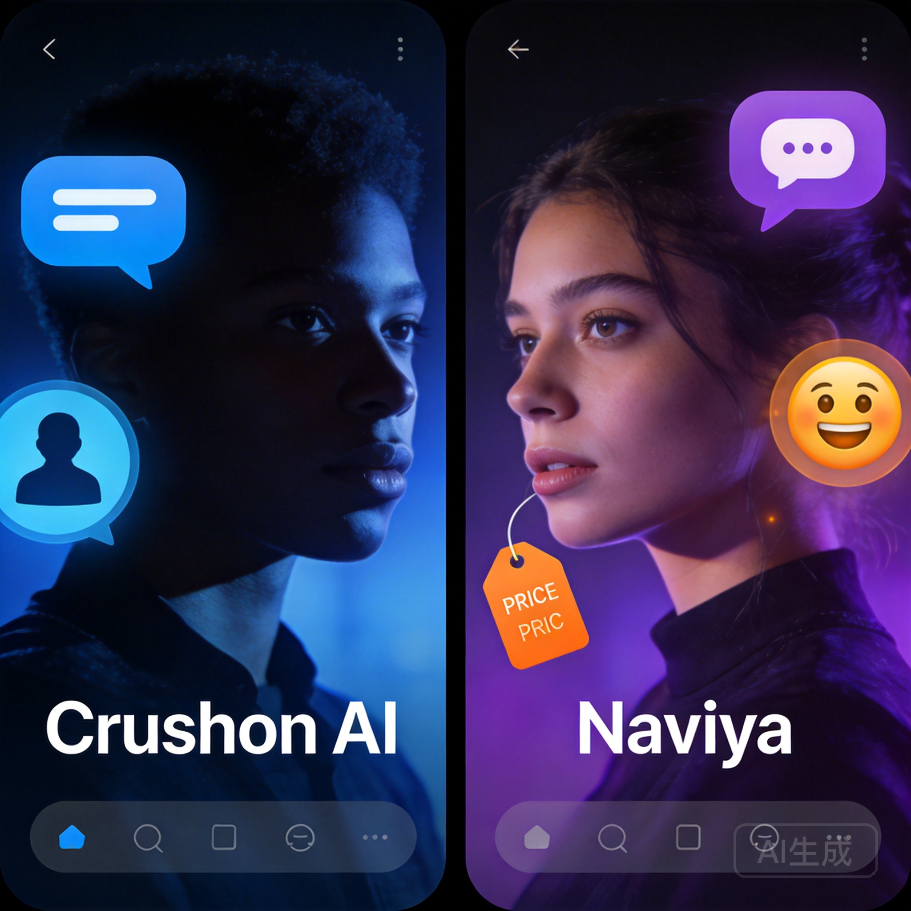

If you've been exploring AI character chat apps, you've probably come across both Crushon AI and Naviya. Both platforms let you chat with AI-powered characters, but they take noticeably different approaches to the experience. So which one actually deserves your time?

I've spent weeks testing both platforms extensively — creating characters, running long conversations, testing edge cases — and I'm going to break down exactly where each one shines and where it falls short.

## What Is Crushon AI?

Crushon AI launched as a romance-focused AI chat platform. It carved out a niche by offering more permissive content policies compared to mainstream platforms like Character.AI. The platform has grown since then, expanding beyond pure romance into broader character interactions.

The core appeal is straightforward: if you want AI characters that can engage in deeper romantic storylines without hitting constant content filters, Crushon AI positions itself as that option.

## What Is Naviya?

Naviya is a broader AI character chat and roleplay platform with 10,000+ characters spanning romance, adventure, anime, fantasy, mystery, and slice-of-life genres. It's designed for people who want rich, immersive conversations — whether that's a fantasy quest, a mystery to solve, or yes, a romantic storyline.

What sets Naviya apart is the character creation toolkit. You can build your own AI characters from scratch, complete with custom personalities, backstories, and conversation styles. There's also voice chat and AI-generated images baked into the experience.

## Feature-by-Feature Breakdown

### Character Library

**Crushon AI** has a growing library, primarily weighted toward romance and companion characters. The selection has expanded over time, but you'll notice the catalog leans heavily into relationship-oriented interactions. If that's your thing, the depth is decent. If you want variety across genres, it can feel limited.

**Naviya** offers 10,000+ characters across multiple genres. The diversity is genuinely impressive — you can go from chatting with a noir detective to an anime rival to a fantasy healer in the same session. The community-created characters add even more variety, and the quality of top-rated characters is consistently strong.

**Winner: Naviya** — the genre diversity isn't even close.

### Character Creation

**Crushon AI** offers basic character creation tools. You can set up a character with a name, description, and personality traits. It works, but the customization depth is limited. Advanced users might find it frustrating.

**Naviya** gives you significantly more control. You can define detailed backstories, set specific conversation styles, configure how the character responds to different topics, and even set up scenario-specific behaviors. The learning curve is slightly steeper, but the results are noticeably better.

**Winner: Naviya** — more tools, more depth, better results.

### Conversation Quality

This is where things get interesting. Both platforms use large language models, but the implementation matters enormously.

**Crushon AI** conversations tend to be responsive and contextually aware within shorter exchanges. However, in longer conversations (50+ messages), I noticed the AI sometimes loses track of earlier context or contradicts established character traits. The emotional range is decent for romance scenarios but can feel one-note in other contexts.

**Naviya** maintains character consistency impressively well across long conversations. The AI remembers details from earlier in the chat and weaves them back in naturally. Characters feel more three-dimensional — they have moods, they reference past events, and they react differently based on how the conversation has evolved.

**Winner: Naviya** — especially for longer, story-driven conversations.

### User Interface

**Crushon AI** has a clean, mobile-friendly interface. Navigation is intuitive, and finding characters is straightforward. The chat interface itself is simple — maybe too simple for power users who want more control over the conversation.

**Naviya** offers a polished interface across both mobile and web. The design is modern without being cluttered. Character profiles are detailed, and the chat interface includes useful features like voice chat toggle and image generation. It strikes a good balance between simplicity and functionality.

**Winner: Tie** — both are well-designed, just different priorities.

### Pricing

**Crushon AI** operates on a freemium model with message limits on the free tier. Premium unlocks unlimited messaging and access to certain character features. Pricing is competitive but can feel restrictive on the free tier.

**Naviya** also uses a freemium approach. The free tier is genuinely usable — you can have meaningful conversations without immediately hitting a paywall. Premium plans are available for users who want unlimited access and additional features.

**Winner: Naviya** — the free tier is more generous.

## Who Should Choose Crushon AI?

Crushon AI makes sense if:
- Romance-focused AI chat is your primary interest
- You want a simple, no-frills interface
- You prefer a smaller, more curated character library
- Content permissiveness is your top priority

## Who Should Choose Naviya?

Naviya is the better choice if:
- You want variety across genres (not just romance)
- Character creation and customization matter to you
- You enjoy longer, story-driven conversations
- Voice chat and AI images enhance your experience
- You want a generous free tier to start with

## The Verdict

Crushon AI found its audience by being permissive and romance-focused. That's a valid niche, and if it's exactly what you want, it delivers.

But for most users — especially those who want depth, variety, and creative tools — Naviya offers a more complete package. The character library is larger, the creation tools are more powerful, the conversation quality holds up better over time, and the free tier actually lets you experience the platform meaningfully.

Neither platform is perfect. Crushon AI could use more genre diversity and deeper customization. Naviya could streamline some of its more advanced features for casual users. But if I had to recommend one to a friend who asked "which AI chat app should I try?" — I'd point them to Naviya.

Ready to see for yourself? [Try Naviya free — no sign-up required](https://naviya.chat) and explore the character library. You might be surprised how quickly a good AI conversation pulls you in.

## Frequently Asked Questions

### Is Crushon AI free?
Crushon AI offers a free tier with limited messages per day. Premium plans unlock unlimited messaging and additional features.

### Can I create my own characters on Naviya?
Yes. Naviya has a full character creation toolkit where you can define personality, backstory, conversation style, and more. [Create your first character here](https://naviya.chat/create).

### Which app has better AI responses?
In my testing, Naviya maintained better character consistency across long conversations. Crushon AI performs well in shorter exchanges but can lose context over extended chats.

### Are these apps available on mobile?
Both are available on iOS and Android. Naviya also has a full web experience at [naviya.chat](https://naviya.chat).

