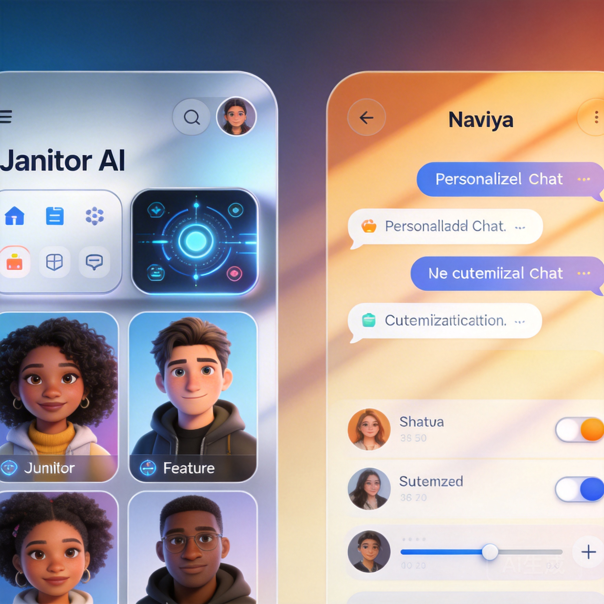

Janitor AI and Naviya represent two different philosophies in the AI character chat space. Janitor AI is the power user's playground — maximum customization, community-driven content, and a hands-off approach to moderation. Naviya aims for a polished, feature-rich experience with strong AI quality across the board.

Which approach works better? That depends entirely on what you value. Let me break it down after extensive testing of both platforms.

## Platform Overview

### Janitor AI

Janitor AI grew out of the community's desire for more control over AI character interactions. The platform gives character creators enormous flexibility in defining how their characters behave, respond, and evolve. The community has responded by building a massive library of characters — many of which are impressively detailed.

The trade-off is polish. Janitor AI's interface is functional but not beautiful. Navigation can be confusing for newcomers, and the quality of characters varies wildly because anyone can create and publish them.

### Naviya

Naviya takes a more curated approach. The platform offers 10,000+ characters with consistent quality standards, a polished interface, and features like voice chat and AI-generated images that go beyond pure text conversation. Character creation tools are powerful but more guided than Janitor AI's open-ended approach.

## Deep Dive Comparison

### Character Creation & Customization

This is Janitor AI's strongest card. The platform gives creators access to detailed system prompts, personality matrices, scenario setups, and behavioral rules. If you know what you're doing, you can build characters with incredibly specific behaviors and conversation patterns.

Naviya's creation tools are more structured. You define personality traits, backstory, conversation style, and scenario parameters through a guided interface. It's less flexible than Janitor AI's raw approach but produces more consistent results — especially for creators who aren't prompt engineering experts.

**For power users**: Janitor AI wins on raw flexibility.
**For everyone else**: Naviya's guided approach produces better results with less effort.

### Character Quality

Here's where the community-driven vs. curated debate gets real.

Janitor AI's library is huge, but quality is inconsistent. The top 10% of community characters are genuinely excellent — creative, well-written, deeply characterized. The bottom 50% are mediocre to poor. Finding the gems requires patience and community recommendations.

Naviya maintains a higher quality floor. Characters are reviewed and curated, so even random browsing tends to surface decent options. The ceiling might not be quite as high as Janitor AI's best community creations, but the average experience is significantly better.

**Winner**: Depends on your patience. If you're willing to dig, Janitor AI has hidden gems. If you want consistent quality, Naviya delivers.

### Conversation Quality

Both platforms use capable language models, but the conversation experience differs.

Janitor AI conversations are heavily influenced by the character creator's prompt engineering. Well-crafted characters produce excellent conversations. Poorly crafted ones produce generic, repetitive responses. The platform itself doesn't do much to compensate for weak character definitions.

Naviya's AI layer adds intelligence on top of character definitions. Even characters with simpler setups produce nuanced, contextually aware responses. The platform's conversation engine handles things like emotional continuity, topic transitions, and character consistency at a system level.

**Winner: Naviya** — more consistent quality regardless of character complexity.

### User Interface

Let's be direct: Janitor AI's interface is functional but dated. Navigation is cluttered, search could be better, and the overall aesthetic feels like it was designed by developers rather than designers. It works, but it doesn't delight.

Naviya's interface is modern, clean, and intuitive. Character discovery is well-organized, the chat interface is comfortable for long sessions, and features like voice chat and image generation are seamlessly integrated. It feels like a product that's been thoughtfully designed.

**Winner: Naviya** — noticeably more polished.

### Community

Janitor AI has a passionate, active community. Character creators share tips, collaborate on complex characters, and provide feedback. The community forums and Discord are lively. If you enjoy the social aspect of character creation, Janitor AI's community is hard to beat.

Naviya's community is growing but smaller. The focus is more on using characters than creating them, though the creator community is expanding. Community features are being built out, but Janitor AI has a head start here.

**Winner: Janitor AI** — the community is a genuine strength.

### Features Beyond Chat

**Janitor AI**: Primarily text-based chat. Some characters support image generation, but it's not a core platform feature. The focus is squarely on text conversation quality and customization.

**Naviya**: Text chat, voice chat, AI-generated images, character creation tools, and cross-genre exploration. The feature set is broader, giving you more ways to interact with characters beyond typing.

**Winner: Naviya** — more features, more ways to engage.

### Pricing

Both platforms offer free tiers. Janitor AI's free experience is decent but can be limited during peak usage times. Naviya's free tier is generous enough for meaningful exploration. Premium plans on both platforms unlock full access.

**Winner: Naviya** — slightly more generous free tier with more consistent availability.

## The Verdict

Janitor AI is the platform for people who want maximum control and don't mind a rougher experience to get it. If you're a prompt engineering enthusiast who loves building characters from scratch and digging through community creations to find gems, Janitor AI rewards that investment.

Naviya is the platform for people who want a polished, feature-rich experience with consistent quality. If you want to start chatting with great characters immediately, create your own without a steep learning curve, and enjoy features like voice chat and AI images — [Naviya is the better choice](https://naviya.chat).

Neither is objectively "better." They serve different audiences with different priorities. But for most users who just want great AI conversations without the hassle, Naviya's approach wins.

[Try Naviya free](https://naviya.chat) and see if the polished experience matches what you're looking for. You can always explore Janitor AI later if you want more raw customization power.

## FAQ

### Can I import Janitor AI characters to Naviya?
Not directly. The character definition formats are different. However, you can recreate characters on Naviya using its creation tools, adapting the personality and backstory.

### Which platform has more characters?
Janitor AI has a larger total library due to its open community creation model. Naviya has 10,000+ curated characters with more consistent quality.

### Is Janitor AI harder to use?
The learning curve is steeper, especially for character creation. The interface is less intuitive than Naviya's. However, experienced users appreciate the additional control.

### Do both apps work on mobile?
Naviya has dedicated iOS and Android apps plus a web experience. Janitor AI is primarily web-based with a mobile-responsive site. [Download Naviya](https://naviya.chat) for the best mobile experience.

