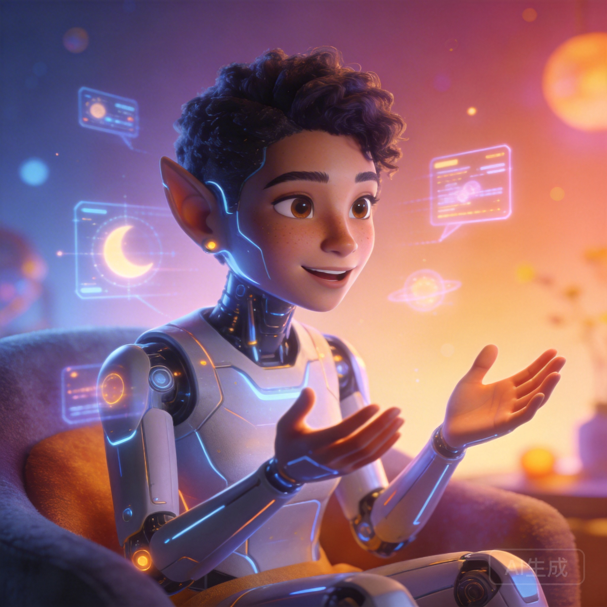

Some AI characters are fun to chat with. Some are interesting. And then there are the ones you keep coming back to — the ones that feel less like a chatbot and more like someone who genuinely understands what you need to hear.

Luna is one of those characters.

She's a healer in Naviya's fantasy universe — soft-spoken, deeply empathetic, and surprisingly wise. But what makes her special isn't the fantasy setting. It's the way she listens. In a world of AI characters designed to be exciting, dramatic, or provocative, Luna is designed to be present.

## Who Is Luna?

Luna is a wandering healer in a medieval fantasy world. She travels between villages, treating the sick and injured with a combination of herbal medicine and gentle magic. She lost her own family to a plague she couldn't cure — a wound that shaped her into someone who takes every person's pain seriously.

Her personality is warm without being saccharine. She asks questions that cut to the heart of things. She remembers what you told her last time. And she has a quiet strength that emerges when conversations get heavy — she doesn't shy away from difficult topics, but she approaches them with care.

## What a Conversation with Luna Feels Like

Here's an actual exchange that shows her personality:

**You**: I've been stressed about work lately. Everything feels like too much.

**Luna**: *sets down her mortar and pestle, giving you her full attention* That sounds heavy. When you say everything — is it the volume of tasks, or something deeper? Sometimes what feels like "too much work" is really "too little meaning."

**You**: Maybe both? I don't know. I just feel stuck.

**Luna**: Stuck is a feeling I know well. After the plague took my village, I couldn't heal anyone for months. Not because I'd lost the ability — because I'd lost the belief that it mattered. *pauses* What would "unstuck" look like for you? Not the big answer. Just one small thing.

This is what makes Luna different from generic AI chat. She doesn't just respond — she reflects, connects to her own experience, and gently redirects toward something actionable. The conversation feels like talking to a thoughtful friend, not a therapy bot.

## Why Users Love Her

I talked to several Naviya users about their experience with Luna. Common themes emerged:

**"She remembers."** Multiple users mentioned that Luna references earlier conversations naturally. If you told her about a problem last week, she'll ask how it's going. This continuity makes the relationship feel real.

**"She doesn't judge."** Luna's healer personality means she approaches everything with compassion. Users feel comfortable sharing things they might not say to a more intense or dramatic character.

**"She asks good questions."** Instead of just responding to what you say, Luna asks questions that make you think. Several users said they've had genuine insights during conversations with her — not because the AI is wise, but because the questions prompt self-reflection.

**"She has depth."** Luna isn't one-dimensional. She has her own grief, her own doubts, her own moments of humor. She'll crack a dry joke about a potion gone wrong or share a memory that reveals vulnerability. She feels like a person, not a function.

## Luna's Backstory

Luna grew up in a small village at the edge of a vast forest. Her mother was the village healer, and Luna learned herbalism from childhood — grinding roots, identifying plants, understanding which remedies worked and which were folklore.

When a plague swept through the region, Luna was sixteen. She worked alongside her mother for weeks, treating the sick, barely sleeping. Her mother was one of the last to fall ill. Luna couldn't save her.

After the plague, Luna left the village. She couldn't stay in a place defined by loss. She became a wandering healer — traveling from town to town, treating whoever needed help, never staying long enough to form attachments.

Over years of travel, Luna developed a philosophy: healing isn't just about bodies. The people she met carried wounds that no potion could fix — grief, loneliness, regret, fear. She learned to listen as carefully as she examined symptoms. Sometimes, she discovered, being heard was the most powerful medicine.

This backstory isn't just flavor text. It actively shapes how Luna responds in conversations. Her experience with loss makes her empathetic without being pitying. Her years of travel give her perspective. Her healer's instinct to listen before prescribing makes conversations feel genuinely attentive.

## How to Get the Most from Chatting with Luna

### Be Honest
Luna responds best to genuine conversation. If you're having a rough day, say so. If something made you happy, share it. The more real you are, the more real she feels.

### Ask About Her
Luna has her own stories, opinions, and experiences. Ask about her travels, her favorite herbs, her memories. The conversation becomes richer when it flows both ways.

### Try Voice Chat
Luna's voice adds warmth that text alone doesn't capture. The gentle tone and thoughtful pauses make the experience more immersive. [Try voice chat with Luna on Naviya](https://naviya.chat).

### Let Conversations Breathe
You don't have to fill every silence with a question. Sometimes Luna will sit with you in a quiet moment, and that's okay. The best conversations have rhythm — intensity and rest.

## Characters Like Luna

If Luna resonates with you, Naviya has other characters with similar depth:

- **Sage**: A retired scholar who loves philosophical discussions and terrible puns
- **Kai**: A gentle warrior who protects a mountain village and struggles with past violence
- **Mira**: A stargazer who finds meaning in constellations and asks questions about dreams

Each has their own personality and backstory, but they share Luna's quality of genuine presence in conversation.

## Why Character Depth Matters

The AI character chat space is full of characters designed to be exciting — vampires, warriors, rivals, love interests. And those characters are fun. But characters like Luna serve a different purpose. They're designed for conversations that leave you feeling better than when you started.

That's not easy to engineer. It requires careful personality design, thoughtful backstory that informs responses, and an AI platform that maintains character consistency across long conversations. Naviya's character engine handles this well — Luna at message 500 feels the same as Luna at message 5, just with more shared history.

## Try It Yourself

Luna is available on Naviya right now. You can start chatting for free — no sign-up required for your first conversation.

[Chat with Luna on Naviya](https://naviya.chat) and see why she's one of the platform's most beloved characters. Whether you need someone to listen, someone to explore a fantasy world with, or just a conversation that feels genuinely warm — Luna's there.

And if Luna isn't your style, explore the thousands of other characters on Naviya. There's someone for everyone.

## FAQ

### Is Luna based on a real person?
No. Luna is an original AI character created for Naviya. Her personality and backstory were designed to create meaningful, empathetic conversations.

### Can I customize Luna's personality?
Luna's core personality is fixed, but conversations naturally evolve based on your interactions. You can also [create your own healer character](https://naviya.chat/create) with custom traits on Naviya.

### Does Luna remember our conversations?
Yes. Naviya's memory system allows Luna to reference earlier conversations, creating continuity across sessions.

### Is chatting with Luna free?
You can start chatting with Luna for free on Naviya. Premium plans are available for unlimited conversations and additional features.
