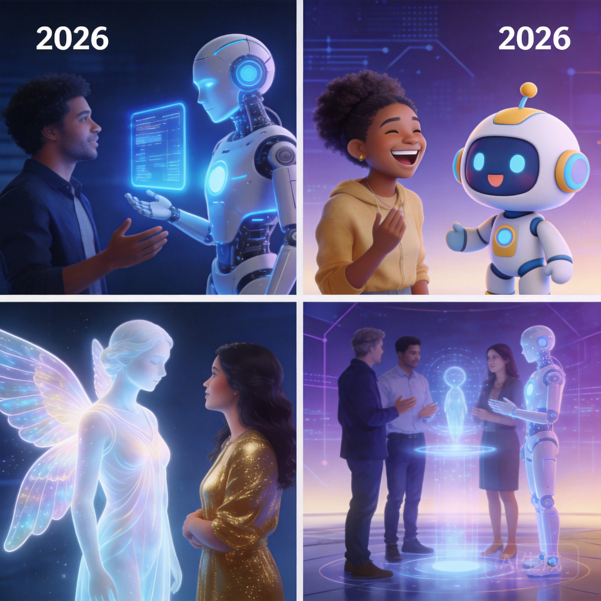

# Talk to AI: 7 Reasons People Chat With AI Characters in 2026

Something shifted in how people talk to AI. It's no longer just about asking for recipes or debugging code. In 2026, millions of people open their phones every day to talk to AI characters — not assistants, not search engines, but *characters* with personalities, backstories, and the ability to hold a conversation that actually goes somewhere.

The numbers tell part of the story. AI character chat platforms collectively serve over 100 million conversations per month. But numbers don't explain *why* someone spends an hour chatting with a fictional elven mage or a noir detective. The reasons are more human than you'd expect.

## 1. Creative Expression Without Judgment

Writing is vulnerable. Sharing your creative ideas with other people means risking criticism, awkwardness, or the dreaded "that's... interesting." AI characters remove that barrier entirely.

When you talk to an AI character, you can explore wild story ideas, test dialogue, build worlds, and experiment with narrative without anyone judging the result. The character plays along. It responds in-character. It treats your ideas as real within the fiction.

This is why writers, game designers, and tabletop RPG enthusiasts have become some of the most active users of AI character chat. It's not replacing human collaboration — it's providing a low-stakes sandbox where ideas can develop before they're ready for an audience.

A novelist working on a fantasy series might spend an evening chatting with a character modeled after their protagonist, testing how that character would respond to plot twists. A D&D dungeon master might roleplay scenarios with an AI to prepare for their next session. The creative applications are genuinely practical.

## 2. Practicing Social Situations

This one surprises people, but it's one of the most common use cases: using AI characters to practice real-world social interactions.

Job interviews. Difficult conversations with a boss. Asking someone out. Navigating conflict with a friend. These situations are stressful precisely because the stakes feel high and you can't rehearse them with the actual person involved.

AI characters offer a rehearsal space. You can practice a tough conversation multiple times, try different approaches, and build confidence before the real thing. The character responds naturally, which means you're not just talking to a mirror — you're getting realistic pushback and reactions.

Research from [Stanford's Human-Computer Interaction lab](https://hci.stanford.edu/) has shown that conversational practice with AI can measurably reduce social anxiety in specific scenarios. It's not therapy — but it's a useful tool in the toolkit.

Platforms like [Naviya](https://naviya.chat) offer characters specifically designed for these scenarios: interview coaches, debate partners, and conversation practice companions that adapt to your skill level.

## 3. Exploring Perspectives You Don't Have Access To

Want to understand how a medieval blacksmith thinks about their craft? Curious about the worldview of a space explorer who's been alone for years? Interested in how a character from a completely different culture approaches a problem?

AI characters let you step into conversations with perspectives that would be impossible to access otherwise. This isn't about replacing real human diversity — it's about expanding the range of viewpoints you can engage with on demand.

Educators have started using this for history and literature classes. Instead of just reading about historical periods, students can have conversations with characters grounded in those contexts. It's not historically perfect, but it makes the material stick in a way that textbooks don't.

## 4. Companionship Without Complexity

Let's be honest about this one. Some people talk to AI characters because they're lonely, and that's okay.

Human relationships are complicated. They require energy, reciprocity, timing, and emotional bandwidth that isn't always available. AI characters offer a form of companionship that's available at 3 AM when you can't sleep, during a lunch break when you need a mental reset, or on a long commute when you want someone to "talk" to.

This isn't a replacement for human connection — and the best platforms are transparent about that. But dismissing it as "sad" misses the point. People have always found comfort in parasocial relationships: with book characters, TV personalities, podcast hosts. AI characters are a more interactive version of something humans have always done.

The key is balance. AI companionship works best as a supplement to human relationships, not a substitute. The healthiest users tend to be people who also maintain real-world social connections but enjoy AI chat as an additional outlet.

## 5. Entertainment That Responds to You

Netflix doesn't change its plot based on what you say to the screen. Books don't rewrite themselves when you disagree with a character's decision. AI character chat is entertainment that *responds*.

This is the fundamental appeal for the entertainment-focused user. Every conversation is unique. The story goes where you take it. You're not a passive consumer — you're a participant.

The gaming community understood this first. Interactive fiction has existed for decades, from text adventures to choose-your-own-adventure books. AI character chat is the natural evolution: instead of picking from pre-written options, you say whatever you want and the story adapts.

Some users treat it like collaborative storytelling. Others approach it more like a game, trying to navigate complex scenarios or solve mysteries. The format is flexible enough to support both.

On [Naviya](https://naviya.chat), you'll find characters designed for everything from epic fantasy quests to cozy slice-of-life conversations. The variety means there's always something that matches your mood.

## 6. Language and Communication Practice

This use case has grown significantly in the past year. People are using AI characters to practice foreign languages in a way that feels natural rather than academic.

Traditional language learning apps drill vocabulary and grammar. AI character chat lets you practice *conversation* — the messy, unpredictable, context-dependent skill that's hardest to develop without immersion.

A character set in a Tokyo café can help you practice casual Japanese. A character who's a Parisian art dealer can challenge your French in a specific domain. The conversation adapts to your level, and there's no embarrassment when you make mistakes.

Several language teachers have started recommending AI character chat as homework. It's not a replacement for structured learning, but it fills the gap between textbook exercises and real-world conversation that most learners struggle with.

## 7. Processing Emotions Through Fiction

This is perhaps the most nuanced reason people talk to AI characters, and it's worth discussing carefully.

Fiction has always been a way to process difficult emotions at a safe distance. When you read a novel about grief, you're not grieving — but you're engaging with grief in a way that can be meaningful. AI character chat extends this principle into interactive territory.

Someone dealing with a loss might find comfort in a conversation with a wise, empathetic character — not because the AI understands their pain, but because the act of articulating feelings, even to a fictional entity, can be clarifying. Someone working through anger might benefit from a conversation with a character who challenges them constructively.

This is not therapy. It's important to be clear about that. AI characters are not mental health professionals, and platforms that position them as such are being irresponsible. But as a form of emotional expression — similar to journaling or talking to a pet — it has genuine value for many people.

## The Bigger Picture

The reasons people talk to AI characters are as varied as the people themselves. What unites them is a desire for interaction that's available, responsive, and free from the social pressures that come with human conversation.

This doesn't mean AI chat is "better" than human interaction. It's different. It fills different needs. The healthiest relationship with AI characters is one where they complement your life rather than replace parts of it.

The technology will keep improving. Characters will become more nuanced, more contextually aware, more capable of sustained narrative. But the core appeal — having someone (or something) that listens, responds, and plays along — is as old as storytelling itself.

We just found a new way to do it.

## Want to Try It?

If you're curious about AI character chat, the best way to understand the appeal is to experience it. [Try Naviya](https://naviya.chat) — pick a character that interests you and start a conversation. You might be surprised where it goes.
