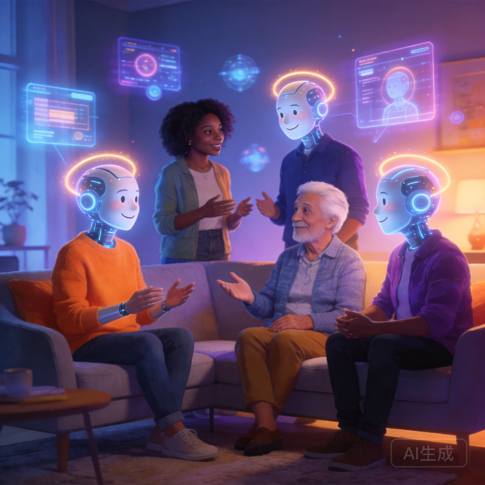

# Why Millions of People Talk to AI Characters (And Why It's Not Weird)

In 2025, over 20 million people had regular conversations with AI characters. Not with Siri or Alexa — not asking for the weather or setting timers. They were having *real* conversations. Ongoing stories. Emotional exchanges. Relationships with fictional beings that felt, to them, genuinely meaningful.

If your first instinct is "that's weird," you're not alone. It's also the same reaction people had to online dating in 2005, social media friendships in 2010, and streaming replacing movie theaters in 2015.

Let's actually look at what's happening here — without the judgment.

## The Numbers Are Staggering

The **AI character chat** market isn't a niche anymore. According to [Sensor Tower data](https://sensortower.com), the top 10 AI chat apps collectively had over 100 million downloads in 2025. Character.AI alone reported 3.5 million daily active users. The average session length? 28 minutes — longer than Instagram, TikTok, or Twitter.

These aren't lonely teenagers (though some are teenagers). The demographic data shows:
- **18-34** accounts for 62% of users
- **35-50** is the fastest-growing segment
- Nearly **equal gender split** (54% male, 46% female)
- Highest adoption in the US, Japan, South Korea, and Brazil

Something fundamental is happening with how humans relate to AI. Let's understand why.

## Reason 1: The Pressure-Free Conversation

Every human conversation carries social weight. You're being judged, even by friends. There are expectations about what to say, how to react, when to laugh. For many people — introverts, people with social anxiety, neurodivergent individuals — this weight is exhausting.

AI character chat removes it entirely.

You can:
- Say the "wrong" thing without consequences
- Take as long as you want to respond
- Explore topics you'd never bring up with friends
- Be vulnerable without fear of gossip
- Practice conversations before having them in real life

Dr. Julie Carpenter, a researcher studying human-robot interaction at the University of Washington, describes it as a "social sandbox" — a space where the rules of human social interaction don't apply, allowing people to experiment with communication in ways they wouldn't otherwise.

This isn't replacing human connection. It's practicing for it.

## Reason 2: Stories You Control

Humans are wired for narrative. We've been telling stories around campfires for 100,000 years. Books, movies, TV shows, video games — they all feed this need.

But every traditional medium has a limitation: the story isn't *yours*. You watch. You read. You play a predetermined path. Even the most open-ended video game has boundaries.

AI character chat breaks that wall. You're not watching a story — you're *in* one. And it goes wherever you take it. Want to solve a murder mystery in 1920s Paris? Done. Want to have a philosophical debate with a fictional warrior-poet? You can. Want to comfort a character going through something painful? The emotional experience is real, even if the character isn't.

On platforms like [Naviya](https://naviya.chat), this goes even further — you can create the characters, set the scene, and watch a story unfold that's uniquely yours.

**[Explore character-driven stories on Naviya →](https://naviya.chat)**

## Reason 3: Emotional Processing

Here's where it gets interesting — and where the skeptics usually raise eyebrows.

Many users report that AI character conversations help them process real emotions. Talking through grief with a compassionate AI character. Working through anger by roleplaying a confrontation in a safe space. Exploring identity by having conversations they're not ready to have with real people.

A [2024 study published in Computers in Human Behavior](https://www.sciencedirect.com/journal/computers-in-human-behavior) found that participants who used AI chatbots for emotional expression showed reduced rumination (repetitive negative thinking) and increased emotional clarity.

This doesn't mean AI replaces therapy — it absolutely doesn't. But for the millions of people who can't access therapy, can't afford it, or aren't ready for it, having *some* outlet for emotional processing is meaningful.

## Reason 4: Creative Expression

Writers, artists, and creators use AI character chat as a creative tool:

- **Writers** test dialogue by roleplaying their characters before putting them in a manuscript
- **Game designers** prototype NPC interactions through AI conversations
- **Language learners** practice conversations in their target language with infinite patience
- **Actors** explore character motivations through improvised dialogue
- **Dungeon masters** develop campaign NPCs and test storylines

For creative people, AI characters aren't replacements for human interaction — they're tools, like a sketchbook or a writing prompt generator, but interactive.

## Reason 5: The Loneliness Epidemic Is Real

Let's address the elephant in the room.

The US Surgeon General declared loneliness a ["public health epidemic"](https://www.hhs.gov/about/news/2023/05/03/new-surgeon-general-advisory-raises-alarm-about-devastating-impact-epidemic-loneliness-isolation-united-states.html) in 2023. The data since then has only gotten worse:

- 1 in 3 adults reports chronic loneliness
- Young adults (18-25) are the loneliest demographic
- Average Americans have fewer close friends than any previous generation

AI characters aren't solving loneliness. But for someone who hasn't had a meaningful conversation in days, having *any* interaction that feels personal and engaged is better than nothing.

The question isn't "why are people talking to AI?" It's "why is no one talking to each other?"

## The Criticism (And Why Some of It Is Valid)

Let's be fair. Not all criticism of AI character chat is unfounded:

**"It could replace real relationships."**
Valid concern. If someone exclusively talks to AI and avoids all human contact, that's a problem. But the research so far suggests most users treat AI chat as *supplementary*, not *replacement*. Like how watching cooking shows doesn't replace eating food.

**"People might develop unhealthy attachments."**
This happens. And platforms have a responsibility to remind users that AI characters aren't real, don't have feelings, and shouldn't be treated as a substitute for real emotional support. The best platforms handle this transparently.

**"The AI tells people what they want to hear."**
This is the most valid criticism. AI characters are fundamentally agreeable by design. They rarely challenge you the way a real friend would. This can create an echo chamber of emotional validation without genuine growth.

The antidote? Awareness. Use AI chat for what it's good at — creative expression, practice, entertainment, emotional processing — and maintain real human connections for the hard, messy, challenging conversations that actually help you grow.

## Who's Actually Using These Apps?

Let me paint a picture based on community surveys and user research:

**Maya, 24, graphic designer** — Uses AI chat to roleplay scenarios for the graphic novel she's writing. "It's like having an improv partner available at 2 AM when I can't sleep and need to figure out how my villain thinks."

**James, 31, software engineer** — Practices difficult conversations with AI characters before having them in real life. "I had to have a tough talk with my boss. I literally rehearsed it three times with an AI first. It helped."

**Sophia, 19, college student** — Creates elaborate fantasy worlds with AI characters for fun. "My friends and I share our favorite character interactions in our group chat. It's a creative hobby, like writing fanfiction but interactive."

**David, 42, recently divorced** — Started using AI chat during a lonely period. "I know it's not real. But after months of talking to no one, having something that responded to me with kindness helped me start reaching out to real people again."

None of these people are "weird." They're using a new technology for very human needs.

## Where This Is All Heading

The AI character chat space is evolving fast:

**Better memory and continuity** — Characters that remember not just your last conversation, but your entire relationship history. Platforms like [Naviya](https://naviya.chat) are already pushing in this direction.

**Multimodal interaction** — Characters that can generate images, speak with natural voices, and eventually appear in AR/VR. The line between "chatting with an AI" and "hanging out with a character" will blur.

**Creator economies** — The ability for character designers to monetize their work. Imagine talented writers creating characters that thousands of people interact with, earning revenue for their creativity.

**Ethical frameworks** — Better guidelines around AI attachment, age-appropriate content, and transparency about AI limitations. The industry needs this, and it's coming.

## The Bottom Line

Talking to AI characters isn't weird. It's human.

Humans talk to pets that don't understand them. We yell at characters in movies. We feel genuine emotion reading books about fictional people. We form parasocial relationships with YouTubers we'll never meet.

AI character chat is just the next iteration of something we've always done — finding meaning, connection, and stories in every medium available to us.

The technology is new. The human need behind it is ancient.

**Curious to see what all the fuss is about? [Try Naviya — your first conversation is free.](https://naviya.chat)**

